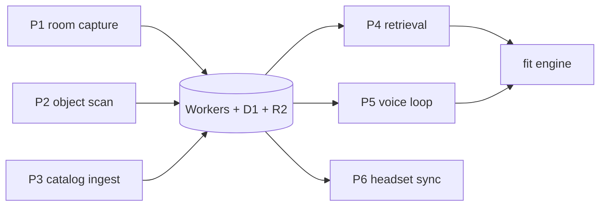

# Full Scale — Build Doc v2

2026-09-19

Organised by ownership, not narrative. Five people pick a component and build against `.claude/contracts.md`.

Live editable copy: https://claude.ai/code/artifact/d5148499-b861-4db6-a48b-0d17cdcda9b8

## Positioning

IKEA Kreativ already ships the v1 core loop, so dimensional accuracy is no longer the pitch. Kreativ does LiDAR room scan, 3D replica with real dimensions, AI erase of existing furniture, placement at accurate scale, and checkout. It is free, inside the IKEA app, and patented. Assume every judge has used it.

What is left, and it is the whole product: **every competitor is catalog-locked and we are not.**

| Claim | Why it holds | Where it is built |
| --- | --- | --- |
| Ingest an object that is not for sale | Kreativ places IKEA SKUs, Houzz places Houzz Shop SKUs, Roomvo places partner surfaces. None can take the desk from your parents' basement, the Marketplace couch, or the floor model you are standing next to. They are retailer tools, so there is nothing in it for them. | A + C, pipeline P2 |
| Retrieval over your own possessions | Each scanned object becomes a document: image embedding, caption, material and colour palette, true dimensions. That supports "find something that fits the 80 cm gap beside my desk and matches its wood tone" — dense vector for style, numeric filter for fit, over your stuff plus catalog. Kreativ structurally cannot do this, because it never captures your belongings. | F, pipeline P4 |
| Cross-catalog, not single-brand | One scene holds an IKEA-class product, a Shopify merchant product, and your own chair. | C + F, pipeline P3 |
| True 1:1 in a headset | Stand inside the room at real scale, not a phone-sized window on it. | D, pipeline P6 |
| Version history | Content-hashed layouts with parent pointers, scrubbed on a timeline. | B + D |
| Moving day | Will my stuff fit in the new place. The one case that is acute, recurring, and unserved. | E |

### Pitch order

1. Lead with **the catalog is an input, not the product**. Show an object that is for sale nowhere.
2. Then **retrieval over your possessions** — the query no retailer tool can answer.
3. Then the fit engine result, with a number attached.
4. Never open with "redesign your room" or with measurement accuracy. Kreativ owns both sentences.

### What this changes from v1

v1 led with fit certainty against a field of "dimensionally a lie" tools. That line is now false against Kreativ, so it is retired. Fit certainty stays as a proof beat, not as the headline.

## Ownership map

Six components, four people. Justin owns D and E together, because the solver's output is drawn by the runtime that consumes it.

| # | Component | Owner | Exposes to everyone else | Critical path |
| --- | --- | --- | --- | --- |
| A | iOS capture + app shell (Expo) | **Thomas** | `RoomCapture v1` JSON, `Object v1` with `state:"measured"` in under 1 s | Yes |
| B | Backend + data layer (Cloudflare) | **Thomas** | The whole `/v1` HTTP surface, R2 keys, the room SSE stream | Yes |
| C | 3D generation (Baseten) | **Ani** | A GLB at R2 key `objects/{id}/mesh.glb`, already bound to `bboxMeters` | Yes |
| D | WebXR / Quest runtime | **Justin** | Nothing. D is a pure consumer of B. | Demo only |
| E | Fit engine + solver | **Justin** | `POST /v1/fit` → `FitReport v1`, `POST /v1/solve` → placements | No, but it is the pitch |
| F | Retrieval + agents + voice | **Paul** | `POST /v1/search`, the OMNI voice loop on the phone | No |

### Rules that make this work

1. A component never reads another component's internals. It reads `.claude/contracts.md`.
2. Every `/v1` endpoint answers from a committed fixture when the request carries `X-Stub: 1`. B ships the stub layer in hours 0–2, before any real logic.
3. The mesh scale binding happens exactly once, in C. A, D, and E never rescale a GLB. If two components both rescale, the object is wrong by the square of the error and nobody finds it until the demo.
4. D earns zero sponsor points. There is no AR/VR track in 2026. Treat every headset hour as demo spend, not investment.

### Seams to confirm

Two pieces of F are split across owners, because they are different skills. Ani writes the embeddings, captions, and palettes, since that is an inference job. Thomas owns the `/search` endpoint shape, since that is a backend endpoint. Paul owns the ranking inside it, and the agent loop on top. Confirm this split before H4.

Per-person operational briefs live in `.claude/workstreams/`. The 36-hour parallel plan lives in `.claude/sprint.md`. The interface authority is `.claude/contracts.md` — if it and this document disagree, that file wins.

## Contracts

The interfaces live in `.claude/contracts.md`, and that file is the authority. It holds the four
schemas every component reads or writes, the HTTP surface, the R2 key layout, the D1 tables, the
Vectorize index shape, the stub rule, and the dependency table with an hour on every edge.

They are deliberately not reproduced here. A schema is looked up constantly and has to sit in a
file that diffs and that anyone can edit. A design doc is read once, to understand why the schema
is shaped the way it is. Two copies of a schema means one of them is wrong and nothing says which.

Four things are worth stating here, because they are decisions rather than syntax.

1. **Metres, everywhere, in every schema and column.** Convert at the UI edge only.
2. **Transport is JSON, never USDZ.** The room ships as wall transforms, opening rectangles, and
   object boxes, rebuilt in three.js from primitives. The USDZ to GLB conversion chain is where
   the weekend dies: coordinate conventions, unit scaling, material loss, headless Blender in a
   container at 3 am. Avoiding that class of problem is worth more than photorealism nobody was
   going to get.
3. **`state:"measured"` is in the schema, not in the UI.** An object comes back with a real
   `bboxMeters` and a null `glbUrl` in under a second. The measured box renders immediately with
   real numbers while the mesh is still generating. That is the perceived-latency fix, and putting
   it in the contract is what stops it being reinvented three times.
4. **The mesh normalisation contract makes the scale binding single-owner.** Component C publishes
   a GLB whose bounding box already equals `bboxMeters`, origin at bottom-centre, +Y up, metres.
   Nothing downstream rescales. If two components both rescale, the error squares and nobody finds
   it until the demo.

## Components A, B, C

### A — iOS capture and app shell (Expo)

**Scope.** Expo Router, Expo UI, two custom native modules in Swift. One wraps `RoomCaptureView` for room scan. One wraps a RealityKit `ARView` for AR placement, with a USDZ plus QuickLook fallback. 3D browsing on the phone uses `expo-gl` and three.js. A Live Activity shows generation progress. Haptics on a fit violation.

**Depends on.** B's `/v1` surface only. It builds against `X-Stub: 1` from hour 0.

**Exposes.** `RoomCapture v1`, and `Object v1` with `state:"measured"` in under one second.

**Done when.** A judge scans a room and an object, both reach B, and the measured box renders with real numbers before the mesh exists.

**Cut if behind, in order.**

1. The RealityKit AR module. Fall back to USDZ and QuickLook, which is 30 minutes of work.
2. The Live Activity. A progress bar in the app says the same thing.
3. The on-phone three.js browser. The headset already shows the scene.
4. Last resort: drop Expo entirely, ship pure Swift, and lose the primary track.

**Traps.**

- `expo-dev-client`, `npx expo prebuild`, and a local Xcode build. Expo Go cannot load a custom native module.
- A config plugin for `NSCameraUsageDescription`, or the app crashes on first camera use.
- LiDAR device required: iPhone 12 Pro or later, iOS 16 or later.
- A free Apple developer account works, with a 7-day provisioning profile.
- Time-box the RoomPlan module to 4 hours. See the H4 gate in `.claude/sprint.md`.

A custom native module wrapping an Apple framework is the Expo differentiator. Most Expo entries never leave the JavaScript sandbox.

### B — Backend and data layer (Cloudflare)

**Scope.** Workers for orchestration, R2 for GLBs and frames, D1 for rooms, versions, objects, and jobs, Vectorize for embeddings, a queue for generation jobs, and one Durable Object per room for the SSE fan-out.

**Depends on.** Nothing. B is the only component that can start at minute zero with no blockers, which is why B owes everyone else the stub layer first.

**Exposes.** Everything in `.claude/contracts.md`.

**Done when.** Every endpoint in `.claude/contracts.md` answers with the right shape, live or stubbed, and the room SSE stream delivers an `object` event end to end.

**Cut if behind, in order.**

1. Vectorize. Fall back to a brute-force cosine scan over the objects table. At a few hundred objects that is fast enough, and it keeps F alive.
2. The job queue. Call Baseten inline with a longer timeout.
3. Auth. A device id header is enough for a weekend.

**Order of work.** Stub layer, then `/objects` and `/uploads`, then `/rooms`, then SSE, then the rest. The order matches the critical path in `.claude/sprint.md`.

### C — 3D generation (Baseten)

**Scope.** Background removal, image-to-3D on Baseten, and the scale binding. Two latency tiers behind one `tier` parameter.

| Tier | Model | Behaviour | Use |
| --- | --- | --- | --- |
| `live` | Stable Fast 3D | One best clean image as input; sub-second on an A100, about 6 GB VRAM, Stability AI Community License, UV unwrap and PBR parameters | The on-stage generation |
| `quality` | TRELLIS 2 or Hunyuan3D Pro | Slower, better | Pre-baked catalog, async upgrade |

**Depends on.** B for job records and R2 keys. Nothing else.

**Exposes.** A GLB at `objects/{id}/mesh.glb` that satisfies all four clauses of the mesh normalisation contract in `.claude/contracts.md`.

**Done when.** An arbitrary object photographed on the venue floor returns a GLB whose bounding box matches the LiDAR measurement to within 1 mm, and a tape measure on the table agrees.

**The binding is the technical thesis.** Generated meshes come out at normalised scale, roughly −1 to 1 per axis. Rescale the generated box to the LiDAR box. It is about ten lines of code, and it is the entire reason the AR view is true rather than decorative. Say it to a technical judge in one sentence: the generative model gives shape, the depth sensor gives size, and we bind them.

**Cut if behind, in order.**

1. The `quality` tier. Run everything on Stable Fast 3D.
2. Background removal. Shoot against a clean surface instead.
3. Generation itself. Fall back to a textured box at the measured dimensions. Ugly, but still dimensionally true, and the fit engine does not care.

**Known failure set.** Single-image generation degrades badly on transparent, reflective, thin, and very dark objects. A MacBook is a good demo object, because it is matte, rectangular, and solid. A water bottle is the adversarial case. Test twenty random objects on Friday so the boundary is known rather than discovered on stage. A sweep gives multiple candidate frames: all useful frames can support SigLIP2 retrieval, while Stable Fast 3D receives one best clean frame, not a multi-view set.

## Components D, E, F

### D — WebXR / Quest runtime

**Scope.** three.js with `@react-three/xr`. Rebuild the room from `RoomCapture v1` primitives: walls are boxes, openings are gaps, unscanned furniture is a per-category proxy. Load GLBs by URL. Grab, move, and rotate an object. A version scrubber on the timeline. Draw `FitReport` geometry in red.

**Depends on.** B's `GET /rooms/{id}`, `GET /versions/{id}`, and the SSE stream. It can run the entire build against the four fixtures with no phone and no server.

**Exposes.** Nothing. D is a pure consumer, which is exactly why it is safe to staff with whoever is least available.

**Done when.** A person in the headset stands in the scanned room at 1:1, an object pushed from the phone appears within 3 seconds, and the version scrubber replays history.

**Cut if behind, in order.**

1. The version scrubber in the headset. Keep it on the phone, where the Expo judges see it.
2. Object manipulation. A read-only walkthrough still lands the 1:1 beat.
3. The whole headset. See the minimum viable demo below for the phone-only fallback.

**Do not use Unity.** It costs about five hours in build-and-deploy cycles. WebXR has no build step, hot reloads from a laptop, and renders the same scene in a desktop browser for the casting monitor.

**Remember the economics.** There is no AR/VR track in 2026. Ubisoft ran one in 2024, Snap in 2025. Every hour here earns zero sponsor points.

### E — Fit engine and solver

**Scope.** Two separate things behind two endpoints.

`POST /fit` is a validator. It checks a layout and reports violations:

- **Clearance corridors.** Walking paths between placed objects against a minimum. 90 cm is a good default and sits in the AODA and ADA neighbourhood.
- **Door swing arcs.** RoomPlan gives door position and width. Sweep the arc and intersect it with placed geometry.
- **Window occlusion.** Does this block the light.
- **Wall adjacency.** Is it against the wall, or floating 4 cm off it.

`POST /solve` is an optimiser. Discretise the floor to a grid and run OR-Tools or `scipy.optimize`. An LLM translates "cozy reading corner" or "redo this under $1,200" into an objective function and constraints. The solver places things.

**Never let an LLM emit coordinates.** The 2025 Shopify track winner paired camera checkout with a real MINLP procurement optimiser. Those judges reward actual optimisation under a legible demo.

**Depends on.** `RoomCapture v1` and `bboxMeters`. Nothing else. E never loads a mesh.

**Exposes.** `FitReport v1` and solved placements.

**Done when.** The solver returns infeasible on an over-stuffed room and the system says so out loud: there is no arrangement of these three pieces that keeps a 90 cm walkway to the door; drop the ottoman, or go 20 cm narrower on the couch. A system that can be wrong and knows it beats a demo made of vibes.

**Cut if behind, in order.**

1. The solver. Keep the validator. A warning is 80% of the beat for 20% of the work.
2. Window occlusion and wall adjacency. Keep door swing and clearance.
3. Sun simulation, which is an optional extension of window occlusion. If it ships, compute solar position from latitude, longitude, and timestamp with the NOAA algorithm, about 40 lines and no API key. Never fake it: `worldAlignment` already gives real compass bearings, so faking costs credibility for zero saving.

### F — Retrieval, agents, and voice

**Scope.** Four pieces split across the owners named in the seam above.

1. **Query embedding.** Scan frame → SigLIP2 → 768-dimensional normalized query embedding.
2. **Indexing.** Catalog products and saved possessions get the same embedding and are stored in Vectorize.
3. **Hybrid retrieval.** Vector similarity finds visually and semantically similar objects. Dimensions, price, and source are hard metadata filters. This is the differentiator in the positioning above, so it outranks the agent loop if time is short.
4. **Voice (OMNI).** One unbroken loop on the phone: hold the phone at an object, ask "what is this, will it fit beside my desk?", get an answer aloud from live video plus measured geometry.

The scanned object becomes the query and does not need to be inserted into the database before searching.

The multi-agent design loop, scout → fit → style → budget, sits on top of search and solve. It is the second Huawei track and the openJiuwen angle.

**Depends on.** B's `/search` and `/solve`. Catalog products and saved possessions must reach `state:"ready"` before indexing; the scanned query does not.

**Exposes.** The search endpoint behaviour and the voice loop.

**Done when.** "Find something that fits the 80 cm gap beside my desk and matches its wood tone" returns results that actually fit, and the dimension filter provably excludes an object that is 5 cm too wide.

**Cut if behind, in order.**

1. The multi-agent loop. One LLM call does the same job on stage.
2. In-headset voice. Quest browser speech support is inconsistent. If it must ship, use push-to-talk on the controller streaming audio to the server, and never trust the Web Speech API to be present.
3. Search itself, last. Losing it costs the second differentiator.

**Build voice on the phone first.** The native Speech framework is on-device, has no latency, and is completely reliable. The phone is already in the demo and already in someone's hand. Voice is not a garnish in a headset, because there is no keyboard and controller text entry is miserable.

Voice also buys three things: the speech modality that Huawei OMNI Live requires, a natural ElevenLabs integration for responses, and cover for generation latency. A narrating agent turns 15 seconds of dead air into 15 seconds of progress.

## Pipelines P1–P6

A component is a person. A pipeline is a handoff between two people. Each pipeline below names its owner, its handoff, the one detail that makes it work, and the failure it owns.

### P1 — Room capture

A → B → D. RoomPlan produces `CapturedRoom`, serialised as `RoomCapture v1` JSON, never USDZ. Upload, then rebuild in three.js from primitives.

**The detail.** Set `ARConfiguration.worldAlignment = .gravityAndHeading` on the capture session from day one. Without it the room has no absolute orientation, window normals are meaningless, and the sun comes from an arbitrary direction while looking completely plausible. Retrofitting means re-scanning everything.

**Failure it owns.** The USDZ → GLB conversion chain: coordinate conventions, unit scaling, material loss, headless Blender in a container at 3 am. JSON transport avoids the class entirely and produces a cleaner room than a photogrammetric mesh would.

### P2 — Object scan

A → C → B → D. The LiDAR bounding box returns in under one second and renders straight away with real numbers. Frames go to Baseten. The generated mesh comes back at normalised scale, roughly −1 to 1 per axis. Rescale it to the LiDAR-measured box.

**The detail.** That binding is ten lines and it is the whole technical thesis. Metric-scale reconstruction from single-view RGB-D has no reliable general solution, which is why every consumer image-to-3D tool ships dimensionally meaningless output. We do not solve it. We sidestep it with a depth sensor.

**Failure it owns.** Perceived latency. The fix is architectural, not cosmetic: `state:"measured"` exists so the phone shows a true number while the mesh is still generating.

### P3 — Catalog ingest

Most cuttable. Shopify storefronts expose `/products.json` and `/collections/<handle>/products.json` with no auth. Verify 15–25 furniture merchants before H0, because some merchants disable it.

Shopify has a weight field but no standard dimensions field, so dimensions live in metafields, free text in `body_html` in mixed units, variant titles like `60" x 30"`, spec images, or nowhere.

1. Regex pass on numbers next to width, depth, height, W, D, H tokens. About 60% for almost no work.
2. LLM pass over the remaining `body_html` with a constrained output schema.
3. VLM pass on spec images where there is no text at all.
4. Validation. Unit sanity, so a sofa is not 8 cm wide. Category priors, so a dining chair is 40–50 cm. Cross-check the claimed width-to-height ratio against the product photo aspect ratio.
5. Confidence score. Low confidence surfaces as "unverified fit" rather than a silent guess.

**The detail.** Step 4 is what the Rox rubric rewards, because it is genuine multi-source resolution. Step 5 is the difference between an agent and a scraper.

**Failure it owns.** Pre-bake 60–100 products offline and cache the GLBs. Do exactly one live generation on stage, on an object the judge names, with the voice agent narrating over the wait.

### P4 — Retrieval

F. Scan frame → SigLIP2 query embedding → Vectorize similarity search over catalog + saved possessions → numeric dimension/price filtering → ranked results.

**The detail.** The query has two halves that must not be mixed. Style is a dense vector similarity. Fit is an integer range filter on `w_mm`, `h_mm`, `d_mm`. Trying to express fit as a vector term produces results that look right and do not fit, which is the exact failure the product exists to prevent.

**Failure it owns.** An empty result set. Always fall back to relaxing the fit filter by 10% and labelling the results as such, rather than returning nothing on stage.

### P5 — Voice (OMNI)

F. One unbroken loop, not three scattered features. Hold the phone at an object for vision, ask the question by speech, identify from live video, reason against the measured geometry, and answer aloud.

**The detail.** Huawei OMNI Live requires vision, speech, and language together on an edge device. A loop satisfies that. Three separate features do not, and the hard three-modality filter is what thins the field.

### P6 — Headset sync

B → D. Phone posts to `/push/{roomId}`, the room Durable Object fans out over SSE, the Quest receives it.

**The detail.** Bring a travel router, about $40, and put every device on it. Conference Wi-Fi at peak judging will not carry phone → server → Quest. This is the single largest latency risk and the cheapest to remove.

**Failure it owns.** Dead air during the handoff. Measure the end-to-end push time on the venue network during the rehearsal block in `.claude/sprint.md`, not at 3 am with the access point to yourself.

## Sprint plan

The plan lives in `.claude/sprint.md`, and that file is the authority. It has four named swimlanes
running at the same time, the sync points, the kill criteria with a judge assigned to each gate,
and the critical path.

The shape behind it, which is the part worth arguing about rather than reading off a schedule:

**Hours 0 to 4 are an integration spike, not a feature block.** The goal is a skeleton that moves
hardcoded data end to end. Nobody writes a feature. If the pieces do not connect at hour four, that
is the hour to know it, not hour thirty.

**There is exactly one serialisation in the whole weekend.** Thomas owes the four fixtures and the
`X-Stub: 1` layer at H1.5. Before that the other three do work with no dependencies at all. After
it, nobody is blocked by a person again — they are blocked by a fixture, which they already have.
Every other apparent dependency is an artefact of not having committed a fixture early enough.

**The track lock at H20 happens before the work is finished.** That is not a scheduling mistake, it
is the constraint. Select for what exists at H20 and change the pitch that afternoon, rather than
discovering the mismatch at the judging table.

**Feature freeze at H31 is a hard line.** A feature that lands at H33 has never been rehearsed, and
an unrehearsed feature is likelier to break the demo than to improve it.

## Checkpoints and kill criteria

A kill criterion works only if it is decided before the hour arrives and by a named person. Assign each gate to someone who is not the owner of the work being judged.

| Gate | Hour | Test | If it fails |
| --- | --- | --- | --- |
| Native module | H4 | The Expo module returns valid `RoomCapture v1` | Drop Expo, ship pure Swift, lose the primary track. Decide at H4, not H6. |
| Skeleton | H4 | Fixture GLB travels phone → server → Quest | Stop feature work. Every person debugs transport until it passes. |
| Binding | H6 | A generated mesh measures correct against a tape measure | Fall back to a textured box at measured dimensions and keep going. |
| Demo spine | H10 | A real object scanned by a stranger reaches the headset at true scale | Cut D entirely and move to the phone-only demo below. |
| Track lock | H20 | See below | — |
| Feature freeze | H31 | Nothing merges except fixes | Revert the branch. Do not negotiate this one at H32. |

### The H20 track lock, Saturday 14:00

This is the hardest checkpoint, because the tracks are selected before the work is finished. Select 5 to 7. Twelve shallow selections read as desperate and dilute every pitch.

Ask three questions at H20, in this order.

1. **Does the fit engine exist?** If not, this is a visualisation project, and visualisation is the lane Kreativ already owns. Select tracks for what exists, and change the pitch that afternoon rather than at the judging table.
2. **Does P3 catalog ingest exist?** Shopify and Rox both hang on it, so they are one bet, not two. Select both or neither.
3. **Does the voice loop run all three modalities?** Huawei OMNI Live is a hard filter. Two of three does not qualify.

### The rehearsal block is a checkpoint too

Rehearse on the venue network with the floor full, at H31–H33. Not at 3 am with the access point to yourself. Latency at peak judging is a different number from latency at 3 am, and it is the number the judges will experience.

Rehearse the failure path explicitly. Decide now what the presenter says when generation takes 20 seconds, and what happens when it returns a bad mesh. A rehearsed failure looks like composure. An unrehearsed one looks like a broken project.

### Station setup, fixed at H31

- A monitor casting the Quest view. This is not optional. Without it, four bystanders see nothing during the best moment.
- The phone on the table, unlocked, camera session already warm.
- A tape measure on the table. It is the cheapest credibility available, and it converts every claim into something a judge can check.
- Every device on the travel router.

### Judge parallelisation

Judges arrive in clumps, so formalise it. Whoever holds the phone is the participant. Everyone else watches the monitor. One judge scans while the others watch the previous result. Generation latency becomes fill time instead of dead air.

The headset is an upsell for a judge who lingers, never a step in the main path. This fixes the latency problem and the throughput problem at once.

## Minimum viable demo

The smallest set that still produces a compelling 60 seconds is **A + B + C + one check from E**. D is not in it.

### What is in

| Need | Component | Why it cannot be cut |
| --- | --- | --- |
| Scan a judge's own object | A | This is the differentiator. Every competitor is catalog-locked. |
| Measured box in under 1 s | A | It carries the latency and the credibility at the same moment. |
| A mesh bound to that measurement | C | Without the binding the scene is decorative and the pitch is false. |
| Store and serve it | B | Minimal: `/objects`, `/uploads`, `/generate`, `/jobs`. |
| One fit violation with a number | E | Door swing only. It is the beat nobody else can do. |
| A pre-scanned room | A, frozen as a fixture | Captured Friday. A judge does not have to supply a room. |

### What is out of the minimum

P3 catalog ingest, hybrid search, the solver, the multi-agent loop, version history, sun simulation, the shareable link, in-headset voice, and the entire Quest runtime.

### The 60 seconds

1. The room is already loaded and already on the screen.
2. The judge picks up the phone and scans an object they brought.
3. The box snaps on with real numbers: "it is already measured, 31.3 by 22.1 centimetres. The mesh is generating."
4. 10 to 15 seconds of narration while it generates. The thesis line goes here: **every other tool can only show you things that are for sale. This one takes the thing in your hand.**
5. The object drops into the room at true scale.
6. Move it toward the door. The fit engine fires: "that blocks the door swing by 11 centimetres." The arc draws in red.
7. Hand them the tape measure.

That is the protected core. Step 3 and step 6 are the two beats that must never break.

### The phone-only fallback

If the Quest fails at 5 am, the demo does not change much. Steps 1 to 7 all run on the phone, with AR placement instead of a headset walkthrough. This is deliberate: there is no AR/VR track in 2026, so the headset earns no sponsor points and must never be a single point of failure.

Keep the headset as the upsell it is. A judge who lingers puts it on. A judge in a hurry sees the whole pitch on the phone.

### The two upgrades worth adding first

When the minimum is safe, add these two before anything else, in this order.

1. **Hybrid search**, from F. "Find something that fits the 80 cm gap and matches this wood tone" is the second claim no competitor can make, and it needs only `/search` plus a results list.
2. **The 1:1 headset walkthrough**, from D. It converts a good demo into a memorable one, and it is the moment people tell other people about.

Version history is third. It is cheap, it is a strong visual beat, and it gives the Expo judges something to grade that is not the headset.

## Tracks and risks

Select 5 to 7 at H20. Expo is primary. Cloudflare rises to tier 1 under the v2 architecture, because Workers, Vectorize, D1, and R2 now carry the differentiator rather than just hosting it.

| Tier | Track | What earns it | Contingent on |
| --- | --- | --- | --- |
| 1 | **Expo — Best Mobile Experience** | The whole product is an Expo app: rooms, object library, version history, scan flows. Two custom native modules wrapping Apple frameworks. Most Expo entries never leave the JavaScript sandbox. | Component A at H4 |
| 1 | **Cloudflare — Best Agent with a Brain** | Workers orchestrate, Vectorize holds the embeddings of your own possessions, D1 holds rooms and versions, R2 holds meshes. The retrieval claim in the positioning is literally a Cloudflare feature. | B plus F search |
| 1 | **Baseten** | Image-to-3D cannot run on the phone, so hosted inference is load-bearing. Two latency tiers. Two Baseten people sit on the judging panel, which is the best attention signal available this year. | Nothing. The safest track on the list. |
| 1 | **Huawei OMNI Live** | Vision, speech, and language in one loop on a phone. The three-modality requirement is a hard filter that thins the field. Cloud API access is explicitly permitted. | P5, which is cheap |
| 2 | **Shopify** | Real products with real dimensions at true scale, and the budget re-solve. | P3, the most cuttable piece |
| 2 | **Rox** | The dimension extraction pipeline: conflicting sources, unit validation, aspect-ratio cross-check, confidence scoring, "unverified fit" flagging. Honest handling of ambiguity is in their rubric. | Same as Shopify. One bet, not two. |
| 2 | **Huawei openJiuwen** | The multi-agent loop: scout → fit → style → budget. | F, after search ships |
| 3 | ElevenLabs or Gemini | Whichever half of the voice loop OMNI does not cover. | Free |

### Risks

| Risk | Severity | Mitigation |
| --- | --- | --- |
| Kreativ comparison from a judge who has used it | Structural | Answer in one sentence and move: Kreativ places IKEA products, and we place the thing in your hand. Then scan their object. Never argue accuracy. |
| "AI makes 3D, you look at it in a headset" is a worn lane | Structural | Lead with catalog-free ingest and retrieval, not with visualisation. If those are the centre of the pitch, this weakens a lot. |
| No AR/VR track exists in 2026 | Structural | Accept it. Budget headset hours as demo spend. Keep the phone-only path complete. |
| 10–20 s scan-to-headset latency | High | Instant measured box, narration, judge parallelisation, own router. |
| No Swift owner | High | Verify before H0. There is no mitigation after H0. |
| Mesh quality on hard objects | Medium | Test 20 objects Friday. Surface confidence. Steer toward matte solids. A water bottle is the adversarial case. |
| Merchants block `/products.json` | Medium | Verify before H0. If blocked, P3 and both tier-2 tracks die together. |
| Headset handoff eats demo time | Medium | Casting monitor. The headset is an upsell, never the main path. |
| Judge does not supply a room | Low | They supply the object. Lean on that, because it is the differentiator anyway. |
| USDZ → GLB conversion | Avoided | JSON transport, rebuilt from primitives. See P1. |

### Open questions

- Is the F split above right? Ani indexes, Thomas serves, Paul ranks.
- Is the demo room scanned in advance, or scanned live at the booth? A pre-scanned fixture is safer and removes 40 seconds from a 60-second demo.
- Which 15–25 merchants, and are they verified?
