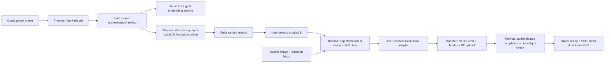

# Ani ML execution plan

Audit date: **2026-09-19** (America/Toronto). This is an audit and proposed build sequence, not an implementation report. No model weights were downloaded, models deployed, accounts changed, indexes mutated, or licenses accepted. Only this document is an intended repository change.

## Active ML workflow policy - updated 2026-09-19

This user-authorized policy supersedes earlier no-commit instructions for Ani's ML workstream only. Historical audit/B01 statements below describe what happened at the time and remain unchanged. Architecture, ownership and step scope do not change.

> After each coherent implementation checkpoint, run the relevant checks, review the exact staged changes, and make a scoped local commit on ani/ml. No further confirmation is needed for ordinary commits that satisfy this policy. Pushes require separate approval.

Before **every** commit:

- Confirm `git branch --show-current` is exactly `ani/ml`. Inspect `git status --short --untracked-files=all`, staged and unstaged diffs. Preserve unrelated/concurrent teammate changes. If unrelated work is already staged or ownership is unclear, stop before changing the index and ask.
- Use the existing Git author identity. If missing, ask; do not invent an identity, change global Git settings, override author/date metadata or add AI co-author trailers.
- Stage only explicit reviewed filenames or hunks within the current step. Never use `git add .`, `git add -A` or `git commit -a`. Review the complete staged diff and run `git diff --cached --check`.
- Check for credentials and unintended files without displaying secret values. Never commit real tokens, credential files, `.env` files, signed URLs, model weights, virtual environments, caches or large generated artifacts. Small documented test fixtures and sanitized reports are allowed only within the current step's scope.
- Run relevant lightweight checks before committing code. If checks fail, fix only within the current task's scope or report the blocker; never label broken work complete. Mocked tests do not prove live generation.
- Prefer one meaningful commit per completed build step or independently testable chunk. Use a clear subject and honest validation/limitations in the body. No empty commits, per-command commits, amend, squash, reset, rebase, force operations or hook bypasses.

This policy authorizes **local commits only**. It does not authorize pushing, merging, paid compute, deployments, account changes, destructive migrations or implementation beyond the currently requested step. Those actions retain their separate authorization requirements. Stop after the requested step and report the commit hash/subject, files, checks, remaining worktree changes and "Not pushed."

## 1. Executive verdict

**The design is plausible, but neither retrieval nor generation currently works.** The useful starting assets are interface documents, route scaffolds, and three JSON fixtures. Local requests confirm that generation, embedding, search, and ingestion return HTTP 501. A successful `/health` is only process liveness. There is no generated GLB, image dataset, Truss configuration, model pin, or test suite in the audited tree.

The smallest successful ML demo proves two independent paths:

1. **Find alternatives:** one authorized phone photo -> real normalized SigLIP2 embedding -> filtered Vectorize results from a small labeled dataset -> select product **B** -> generate from **B's image**, bind to **B's dimensions**, upload validated GLB -> Thomas exposes its URL -> Justin/Thomas renders at scale 1. Query object A's dimensions are never substituted for B's. Search works while every result still has no mesh.
2. **Reconstruct an owned object:** one clean image + three supplied positive dimensions -> the same generator/binder -> validated GLB and provenance. No catalog lookup, vector write, or search success is required.

Start with 12–20 real catalog/possession records, one image per record, one live generation at a time, one SF3D quality setting, and one successful client renderer. Do not pre-bake 60–100 meshes or add a second 3D model. A measured dimensional proxy keeps the placement demonstration usable if generation fails, but **does not pass the live-generation gate**.

Critical blockers, in order:

| Blocker | Evidence | Smallest action to unblock |
| --- | --- | --- |
| SF3D custom inference environment and account capability | Windows CPU-only PyTorch here; no Truss/Docker executable found; SF3D native extensions; event H100 offer is training access, not a provisioned inference endpoint | B01 prepares a reviewable build and access sheet; Ani/account owner confirms custom inference capacity, credits, spend ceiling and HF access before B02 |
| HF model access/license | Anonymous SF3D model-card raw request returned **401**; official README requires gated access | Ani personally reviews/accepts applicable terms and grants read access; never paste tokens into this plan |
| Missing backend seams | `/uploads`, job submission, search, completion, auth, Vectorize access and SSE are not implemented | Thomas agrees to the small seam packet in §9, then implements his paths; Ani builds adapters/tests only |
| No usable retrieval data | `merchants.example.json` explicitly contains placeholders, including a misleading-looking `productsJsonVerified: true`; no image files are present | Paul supplies one real image/variant record first, then the small evaluation corpus |
| Unproved real embedding path | No Transformers installed/pinned; changing the docstring did not implement SigLIP2 | B03 loads pinned real weights in an approved isolated environment and runs one image |
| Mesh orientation/material correctness | No binding code; SF3D applies its own rotations; glTF front differs from project front | B04 tests scene transforms, orientation, materials and reloaded GLB bounds |

**Separate claims throughout the demo:**

| Claim | Evidence that could establish it | Evidence that cannot establish it |
| --- | --- | --- |
| Looks similar | Human relevance labels on held-out images | Merely returning another chair |
| Exact same product | Verified product/variant identity labels and retrieval evaluation | Cosine score or matching category |
| Passes a dimension filter | Known dimensions, explicit orientation, numerical checks | Visual similarity |
| Fits at a room placement | Justin's room/placement geometry checks and measurement assumptions | Three maximum-size comparisons |
| Visually plausible mesh | Real SF3D output inspected from multiple views | A textured box or valid GLB header |
| Mesh matches supplied box | World-space bounds after GLB export/reload, <= 0.001 m error per axis | Tape measurement alone |
| Supplied dimensions are accurate | Measurement/extraction provenance and independent physical checks | Binding error <= 1 mm or `measure.confidence: 0.94` in a fixture |

## 2. Repository reality and ownership

### Snapshot and instructions

`git branch --show-current` -> `main`; `git rev-parse HEAD` -> **`a74ad582d7b9fc7d5cc07f67ea7d237d6cc1a3b6`**. Initial `git status --short` was empty. Git warned that the user's global ignore file was inaccessible; no reset/config change was attempted. `git show --stat --oneline a74ad58` identifies this very HEAD as “Update ML retrieval and Baseten pipeline docs”: ten files, primarily documentation; the Python edit is a docstring. It is not a model implementation.

No `AGENTS.md` or `AGENTS.override.md` was found in the repository or checked ancestor paths (`C:/`, `C:/Users/`, `C:/Users/hp/`, `C:/Users/hp/Desktop/`). Read `CLAUDE.md`, `.claude/contracts.md`, `.claude/sprint.md`, all four workstreams, and textual `BUILD_DOC.md`. No PDFs regenerated. The requested plan did not exist. Instructions make `.claude/contracts.md` the interface authority and Thomas its writer; proposed corrections below do not silently replace that authority. The user's audit and hard-constraint instructions supersede contradictory fallback suggestions in local docs.

| Actual location | Status observed | Owner / implication |
| --- | --- | --- |
| `services/gen/app/main.py` | Five untyped POST stubs (`/generate`, `/bgremove`, `/baseten`, `/bind`, `/embed`), all 501; `/health` 200 | Ani; no model, validation, job execution, storage or embedding behavior |
| `services/gen/app/{embedding,bgremove,baseten,binding}/README.md` | Documentation only | Ani; these directories contain no implementation |
| `services/gen/BINDING.md`, `README.md` | Promises single binding and two tiers, conflates physical accuracy with software tolerance | Ani; correct documentation during implementation |
| `services/gen/requirements.txt`, `Dockerfile` | Unpinned FastAPI, uvicorn, httpx, Pillow, baseten; Python 3.11 slim, serves port 8000 | Ani; no torch/Transformers/trimesh/SF3D dependencies or CUDA build toolchain |
| `docker-compose.yml` | Gen maps `8002:8002`, conflicting with container's 8000 | Thomas owns compose; smallest Ani fix is serve 8002 in gen Dockerfile and update its README |
| `services/search/app/main.py`, `RANKING.md`, `README.md` | `/search` 501; docs claim proxy and hard filters, then demand 10% relaxation | Paul owns ranking/service; Thomas owns public transport. Search Dockerfile uses 8080 but compose maps 8004:8004; Paul/Thomas fix their ports |
| `services/ingest/app/main.py`, `EXTRACTION.md`, `merchants.example.json` | `/crawl`, `/extract` 501; extraction percentages are unmeasured; vendor list explicitly fake | Paul owns vendor discovery, images, product/variant dimensions, source facts and ranking |
| `workers/src/index.ts` | Every real route 501. Stub objects/rooms/fit work; uploads/jobs/search/generate/sync lack fixture implementations | Thomas; no actual proxy, queue consumer, completion handler, R2 adapter or Durable Object implementation |
| `workers/src/schema.sql` | Tables exist as SQL text; no auth scope, frame-key persistence, model fingerprint, variant identity or job idempotency fields; no dimension CHECKs | Thomas. In-memory SQLite accepts `(0,-1,NULL)`; no remote database was queried |
| `workers/wrangler.toml` | Declares R2/D1/Vectorize/queue/DO; D1 ID is all zeros; comment says 768/cosine | Thomas; a binding/comment does not prove a remote index's dimensions, metric, contents or metadata indexes |
| `.claude/contracts.md` | Object/bbox/mesh conventions; `/search` body only `text?, imageKey?, fit?, source?, limit` | No search budget/currency/category/orientation fields, no user/session identity contract, no embedding service payload or callback contract |
| `fixtures/*.json` | Three parseable static examples; object is `ready` with `assets.example.dev` URL; capture provenance not established | Thomas; not proof of a real capture, live storage, or fit-engine execution |
| `fixtures/mesh-macbook.README.md` | Placeholder for **absent** `mesh-macbook.glb` | Ani supplies an artifact; Thomas decides fixture publication. Do not overwrite fixture directory |
| `apps/xr/src/main.jsx`, `src/objects/README.md`, `src/room/TRANSFORMS.md` | JSX scaffold; scale-1/column-major rules are documentation | Justin owns renderer and `services/fit/**` solver/fit; no working GLB load can be assumed |
| `apps/mobile/**` | Expo scaffold; native/screen placeholders; voice subtree belongs to Paul | Thomas owns scanning/backend/mobile rendering; Ani does not implement it |
| Tests, locks, Truss configs, catalog assets | No test files, lockfiles, Truss configs, GLBs, JPEGs or PNGs discovered | All real model and integration gates remain open |

The exact Paul seam is **Ani supplies embeddings and ML evaluation; Paul supplies merchant records and owns filtering/ranking; Thomas provides authenticated storage/Vectorize transport**. Caption/palette requirements in old docs are not outputs of SigLIP's embedding method. Use existing name/category/merchant descriptions where available, mark missing fields honestly, and defer generative captioning. No VLM is justified by current evidence.

### Local execution environment

Read-only checks found Windows build `10.0.26200`, PowerShell `5.1.26100.9444`, Python **3.13.5**, Node **24.14.0**, npm.cmd **11.4.1**, Git **2.49.0.windows.1**. `npm --version` through npm.ps1 is blocked by PowerShell execution policy; `npm.cmd` works without changing policy. Hardware query: AMD Ryzen 5 5500U, 6 cores/12 logical processors, 16,455,946,240 bytes RAM (~15.3 GiB), AMD Radeon integrated graphics. No NVIDIA device was reported.

Installed: torch **2.10.0+cpu**, NumPy **2.3.1**, Pillow **12.1.1**, FastAPI **0.116.1**, httpx **0.28.1**, pytest **9.0.3**. Transformers, trimesh, baseten, Truss and rembg were absent; `docker`, `uv`, `truss`, `nvidia-smi` were not found on PATH. `torch.version.cuda=None`, `cuda.is_available()=False`, `device_count()=0`, `mps.is_available()=False`. This establishes this interpreter's capability, not that every possible environment on the laptop was inventoried. Do not attempt a large Windows/CUDA environment repair during the hackathon.

## 3. Evidence ledger

Statuses mean: **VERIFIED_LOCALLY** = a read/check executed here with the stated observed result; **DOCUMENTED_UPSTREAM** = official source supports the claim, not a local execution; **PROPOSED** = design/target; **UNVERIFIED** = a named gate remains; **CONTRADICTED** = actual evidence conflicts with an existing claim. `BLOCKED` describes an action's prerequisite, not a successful test. Source IDs link to exact official pages in §11.

| Claim | Status | Source or command | Result | Next verification |
| --- | --- | --- | --- | --- |
| HEAD and clean initial tree | VERIFIED_LOCALLY | `git status --short`; `git branch --show-current`; `git rev-parse HEAD`; `git show --stat a74ad58` | main, full SHA above, no initial changes; ignore warning disclosed | Recheck before each edit |
| ML/search/ingest work | CONTRADICTED | Local in-process httpx ASGI calls, probe below | 8 POST paths return 501; only gen health 200 | Real implementations, no stub header |
| Every Worker stub unblocks consumers | CONTRADICTED | Node 24 `stripTypeScriptTypes`, inline imported fixture JSON, call exported `fetch` with empty Env | Stub objects/fit 200; uploads/generate/search 501 with and without X-Stub; all tested non-stub routes 501 | Thomas's real Worker integration; Node probe is not Cloudflare runtime proof |
| Fixtures contain live mesh/data | CONTRADICTED | `rg --files --hidden -g '*.glb' -g '*.jpg' -g '*.png'`; JSON parse; fixture URL read | No image or GLB; example URL; three valid JSON files | Paul dataset; Ani GLB; Thomas working URLs |
| D1 schema enforces dimensions | CONTRADICTED | `sqlite3.connect(':memory:').executescript(schema)` then insert `(0,-1,NULL)` | Insert succeeds; purely in-memory probe | Application validation plus Thomas's schema policy |
| Local CUDA/MPS available | CONTRADICTED | Python torch capability command; CIM hardware queries | CPU build and AMD hardware, no CUDA/MPS | Use authorized remote Linux CUDA |
| SigLIP2 checkpoint is `Siglip2Model` | CONTRADICTED | S1 config and S2 versioned source | `model_type: siglip`; full model is `SiglipModel` | B03 records actual resolved classes |
| 768-dimensional pooled features | DOCUMENTED_UPSTREAM | S1 config + S2 defaults/API source | Both tower defaults 768, text projection defaults to hidden size; methods return pooled tensors | Real `(N,768)` tensor assertion, not fabricated vectors |
| Transformers 4.49 processor is suitable without checking | CONTRADICTED | v4.49.0 `processing_siglip.py` vs tokenizer config | Processor hard-codes SiglipTokenizer; checkpoint specifies GemmaTokenizer. v4.51.3 uses AutoTokenizer | Pin 4.51.3 and real load in B03; incompatibility risk found by source, not reproduced runtime |
| Actual image processor | DOCUMENTED_UPSTREAM + VERIFIED_LOCALLY enum decode | S1 preprocessor, S2; `Image.Resampling(2).name` | 224x224 direct resize, **BILINEAR**, rescale 1/255, mean/std .5; no CLIP center crop | Golden decoded-image preprocessing test |
| Tokenizer automatically caps text at 64 | CONTRADICTED | S1 tokenizer config; S2 text model config | Gemma tokenizer max length is a huge sentinel; text model capacity 64 | Explicit `max_length=64`, padding/truncation tests |
| Real embedding quality/latency | UNVERIFIED | No weights or compatible stack executed | No measurements | B03/B07/B09 |
| SF3D deploys from current Dockerfile | CONTRADICTED | Repo Dockerfile vs S3 requirements/native setup | No native build stack or weights; SF3D pins Transformers 4.42.3, NumPy 1.26.4, hub .23.4 | B01 build packet; B02 authorized Linux build |
| CPU/MPS support | DOCUMENTED_UPSTREAM, local execution UNVERIFIED | S3 README/setup/run | README supports CPU, experimental MPS/Windows; CLI help still says baking fails without CUDA/MPS, while native setup includes CPU path | Do not call CPU impossible; do not make it the live-generation fallback |
| SF3D texture and GLB behavior | DOCUMENTED_UPSTREAM | S3 `run.py`, `system.py` | RGBA conditioning, PBR/UVs, normals export, default texture 1024/remesh none; source already rotates mesh and inverts winding | Real GLB + asymmetric orientation/material test |
| SF3D <1 s / ~6 GB | DOCUMENTED_UPSTREAM for ~6 GB; UNVERIFIED for repo's exact sub-second/A100 claim | README states ~6 GB default; gated model card could not be read and paper timing was not independently inspected | No application latency measured; no A100 here | B02 stage timing and B09 client wall clock; do not repeat sub-second claim as verified |
| HF access | UNVERIFIED / BLOCKED | S3 README + anonymous HF raw card GET | 401; API says gated `auto`; no private access tested | Ani accepts terms and grants scoped read access |
| Baseten H100 offer equals SF3D serving | CONTRADICTED | S4 event guide | H100 workstation/training access requires booth enablement; hosted Model APIs are separate | Confirm custom inference capacity/billing with booth/workspace owner |
| Truss lifecycle can host custom Python | DOCUMENTED_UPSTREAM | S5 Model class/dependencies | `load()` once, `predict()` per request, config/build dependencies; not current FastAPI stub | Actual build/load/request test |
| Vectorize supports our conjunctions | DOCUMENTED_UPSTREAM | S6 filters | Pre-topK filters, implicit AND, equality/membership/ranges; no documented general `$or`/`$and` operator | Live filtered query including boundary cases |
| Metadata indexed retroactively | CONTRADICTED | S6 filters | Create indexes before ingestion or re-upsert old vectors | Thomas inventory and authorized migration |
| Upsert means immediately searchable | CONTRADICTED | S6 client API/insert | Async mutation ID; typically seconds, not a visibility SLA | Measure write-to-query delay separately |
| Remote index has no old CLIP vectors | UNVERIFIED | Repo has no vector payloads; no account calls made | Cannot infer remote cleanliness from renamed comment | Thomas read-only dimensions/metric/metadata inventory; provenance check |
| glTF front equals project front | CONTRADICTED | S8 vs `.claude/contracts.md` | glTF +Z front; project -Z front | Explicit tested conversion, not unconditional repeated rotation |
| 1 mm normalization proves measurements | CONTRADICTED | Contract wording + separation of claims above | Mathematical export tolerance is distinct from measurement error | B04 software test; Thomas/Paul measurement provenance |
| Internal sprint dates equal official dates | CONTRADICTED | S9 rules vs `.claude/sprint.md` | Official build window Sat 00:00 to Sun 08:00 EDT; repo uses Fri 18:00 / Sun 06:00 | Team updates its schedule; honor official initial submission deadline |
| Latency, cache savings, co-hosting advantages | PROPOSED | §6 | Targets and hypotheses only | Stage traces on chosen hardware/network |

### Reproducible safe probes performed

No existing test suite was present. These were scratch checks with installed dependencies, not tests of real ML. `PYTHONDONTWRITEBYTECODE=1` prevented import bytecode in the tracked tree. ASGI probe core (executed via a PowerShell here-string piped to `python -`, for gen paths above, search `/search`, ingest `/crawl` and `/extract`):

```python
import asyncio, importlib.util, pathlib, httpx
async def probe(service, paths):
    path = pathlib.Path('services') / service / 'app/main.py'
    spec = importlib.util.spec_from_file_location('audit_' + service, path)
    module = importlib.util.module_from_spec(spec)
    spec.loader.exec_module(module)
    async with httpx.AsyncClient(transport=httpx.ASGITransport(app=module.app),
                                base_url='http://local-audit') as client:
        for path in paths:
            r = await (client.get(path) if path == '/health'
                       else client.post(path, json={}))
            print(service, path, r.status_code, r.json())
asyncio.run(probe('gen', ['/health','/embed','/generate','/bind','/bgremove','/baseten']))
```

Hardware command: `python -c "import torch; print(torch.__version__, torch.version.cuda, torch.cuda.is_available(), torch.cuda.device_count(), torch.backends.mps.is_available())"` -> `2.10.0+cpu None False 0 False`. Read-only CIM queries required sandbox escalation and reported the hardware in §2. Package versions used `importlib.metadata`, not environment-variable dumps.

Public text was fetched with `Invoke-WebRequest -UseBasicParsing -Uri <official URL> -TimeoutSec 20` into `%TEMP%/ani-ml-audit-20260919`, then inspected as JSON, Python AST, Markdown or HTML text. Initial sandbox web request failed; approved read-only requests succeeded. No weights were fetched. SF3D HF raw README remained 401. AST inspection of v4.51.3 established the default dimensions and `return pooled_output`; it did **not** execute Transformers. Scratch HTML extraction initially hit Windows encoding errors; rerun with explicit UTF-8 completed the relevant readings. These temporary files are not repository deliverables.

## 4. Minimal corrections

All entries below are **proposals**, not changes applied in this audit.

### Ani's changes

| Exact location | Problem | Smallest proposed change | Owner |
| --- | --- | --- | --- |
| `services/gen/app/embedding/`, `app/main.py` | No encoder; tied to ready state | Real pinned one-image/image-or-text endpoint independent of generation; separate indexing action | Ani |
| `services/gen/requirements.txt`, `Dockerfile`; new `deploy/sf3d/` | Unpinned CPU skeleton cannot build SF3D | Isolated embedding/control and SF3D dependency sets; serve gen on 8002 to match existing compose | Ani; component-local dependency files, no shared lock changes |
| `services/gen/app/binding/`, `BINDING.md` | Ten-line sketch ignores scene transforms/front/materials | Pure normalization library, export/reload validator, orientation manifest and distortion policy | Ani |
| `services/gen/app/baseten/` | No supported deployment/client lifecycle | Truss Model class plus thin async submission adapter, JSON receipts and artifact storage | Ani |
| `services/gen/app/main.py`, new `app/jobs/` | No typed input, duplicate protection, completion evidence | Validate authenticated internal envelopes and artifact generation; delegate persistent job authority to Thomas | Ani/Thomas seam |
| `services/gen/README.md`, `.claude/workstreams/ani.md` | Two tiers, all-view guarantee, ready-gated indexing, 60–100 pre-bakes, accuracy overclaims | One live model, one baseline view, index on eligible image/metadata, small dataset, distinct claims | Ani |

### Shared changes requiring owner agreement

| Exact location | Problem | Smallest proposed change | Owner |
| --- | --- | --- | --- |
| `.claude/contracts.md`, `workers/src/index.ts` | Missing embedding/index/async completion transport; public search cannot express budget/currency/category | Agree §9 packet and limited optional search fields; reject unsupported fields until implemented; no silent ignores | Thomas, with Paul/Ani |
| `.claude/contracts.md`, `workers/src/schema.sql` | No possession scope, variant/frame provenance, indexing/job state | Minimal persisted scope, image/variant linkage, fingerprint/index state, idempotency and current-job token; dimensions may be unknown only through an explicit agreed representation | Thomas |
| Same contracts plus object creation | `POST /objects` omits price/productUrl/merchant/variant despite Object supporting some of them | Paul supplies these at ingest; Thomas approves/stores optional fields. Unknown dimensions are not `measured` | Thomas/Paul |
| `workers/wrangler.toml`, index setup owned by Thomas | Remote config/provenance unknown; metadata fields missing | Confirm 768/cosine and fingerprint; metadata indexes before inserts; isolated replacement index if mixed, no destructive migration | Thomas provisioning; Ani vectors; Paul filter validation |
| `services/search/RANKING.md`, `app/main.py`, `.claude/workstreams/paul.md` | Mandatory 10% relaxation and undefined `relaxed` response flag | Default strict empty array; explain no results in client. Near misses only in a separately agreed labeled response, out of core scope | Paul ranking; Thomas API/UI |
| `services/search/README.md`, Worker/search bridge | Verbatim public request alone cannot grant safe R2/Vectorize access | Service-authenticated internal Worker bridge for query + batch hydration; no Cloudflare admin token on client or in Paul code | Thomas/Paul |
| `.claude/contracts.md` R2 key layout | Single mutable mesh key risks stale job overwrite and dimension cache collision | Approve immutable `objects/{id}/meshes/{boundHash}.glb`; D1 already has `glb_key`; complete only current job. Raw cache prefix also needs approval | Thomas; Ani generates keys through authorized adapter |
| `fixtures/`, `workers/src/index.ts` | No usable mesh and incomplete stub coverage | Thomas publishes Ani's labeled artifact and needed fixtures; stub header never used as live evidence | Thomas |
| `apps/mobile/**`, `apps/xr/**` | No ready artifact consumer; provenance label lacks API field | Thomas agrees optional generation provenance and proxy/distortion labels; renderers use scale 1 and do not announce readiness early | Thomas/Justin |
| `.claude/sprint.md`, `BUILD_DOC.md` | Official dates and prize claims differ | Owners reconcile timing; do not infer prize eligibility from infrastructure alone | Team/Thomas |

Do not add a global architecture, second database, alternate vector service, solver implementation, crawler, native module, or agent to fix these seams. “Adding an optional field is always safe” in the contract is too broad: each reader and validator still needs a compatibility test.

## 5. Chosen architecture

All choices here are **PROPOSED** until their named gates pass. Official behaviors are cited separately.

### Paths and ownership boundaries



Indexing is another input to Vectorize: Paul's eligible catalog image or Thomas's saved possession -> Ani image encoder -> validated full metadata upsert through Thomas's authenticated adapter. It does not depend on `/generate` or `state:ready`. A transient query is never inserted to enable `queryById`; query by its vector directly. Unknown-size images can be embedded, but must not be asserted to be measured or pass a constrained fit result.

| Producer -> consumer | Payload | Validation | Failure behavior | Owner |
| --- | --- | --- | --- | --- |
| Phone/Paul -> Worker/R2 | Object or variant identity, image key, supplied bbox/provenance, price+currency when known | Scope, MIME/decode limits, finite positive dimensions when present, exact variant | Reject bad input; retain unknown metadata explicitly | Thomas input/storage; Paul catalog facts |
| Paul search -> Ani encoder | Authorized image reference **or** text; request ID and expected fingerprint | Exactly one modality for baseline, scope/key, bounded text/image | Typed 4xx; model unavailable 503; no fake vectors | Ani endpoint; Thomas auth |
| Ani -> Paul | `values[768]`, `dimension`, `fingerprint`, input hash/modality | float32, finite, norm ~1, matching fingerprint | Refuse incompatible vectors | Ani |
| Ani -> Thomas index bridge | Stable vector ID, values, namespace, complete metadata and fingerprint | Allowed scope, index fingerprint, price/variant/dimensions | Retriable indexing failure does not block mesh or saved object | Ani producer; Thomas transport |
| Paul -> Thomas query bridge | Query vector, namespace, supported strict filter, limit | Scope derived from auth, bounded topK, allowed metadata fields | Empty strict result or dependency error; no widening | Paul filter/rank; Thomas bridge |
| Thomas bridge -> Paul | IDs/scores + one batched hydration of Objects | Authorized IDs, canonical metadata recheck, current variant/availability | Drop invalid/stale rows; fewer results is acceptable | Thomas storage; Paul final filter |
| Selected B or owned object -> Ani job | `jobId`, `objectId`, generation token, image hash/reference, bbox snapshot, provenance, settings fingerprint, expiring storage capabilities | B's image/dims from same snapshot; one image, valid box, live tier | Reject missing dimensions; request measurement; keep proxy if valid dims | Thomas builds snapshot; Ani validates |
| Ani/Baseten -> R2 -> Thomas completion | Immutable artifact key/hash/bytes, bbox validation report, job token, provenance, stage times | Successful PUT/read check, correct key, matching current job/input hash | No ready state on upload/validation failure; stale completions ignored | Ani artifact; Thomas state |
| Thomas -> client/Justin | Object v1 with usable `glbUrl`, agreed provenance, SSE object event | Fetchable GLB; scale 1; dimensions match Object | Keep labeled proxy, refresh expired URL via Worker | Thomas URL/SSE; Justin/Thomas render |
| Object+placement+room -> fit service | Existing bbox/Placement/RoomCapture contract | Measurement status plus actual geometry | Unknown fit when measurements missing/uncertain | Justin, not Ani |

### Embedding baseline and reproducibility

S1 resolves the checkpoint revision to **`75de2d55ec2d0b4efc50b3e9ad70dba96a7b2fa2`**. Pin all model, processor and tokenizer files to this revision; never independently load their `main` branches. Architecture is **`SiglipModel`**, `SiglipVisionModel` + `SiglipTextModel`, 12 layers/12 heads/hidden 768 defaults, vision patch16 at 224, text vocab **256000** and context **64**. The checkpoint is a SigLIP2-trained fixed-resolution model using the SigLIP implementation. It is not the NaFlex model. License on the model card: Apache-2.0. [S1, S2]

Chosen **candidate**, not tested environment: Python **3.11.9**, CPU torch **2.6.0**, Transformers **4.51.3**, tokenizers **0.21.1**, huggingface-hub **0.30.2**, safetensors **0.5.3**, sentencepiece **0.2.0**, NumPy **1.26.4**, Pillow **11.1.0**. Pin FastAPI **0.116.1**, httpx **0.28.1**, uvicorn **0.34.0**, pytest **8.3.5** for this isolated service/test environment. Use slow `SiglipImageProcessor` (`use_fast=False`) and explicit `AutoTokenizer(..., use_fast=True)` resolving GemmaTokenizerFast; assemble `SiglipProcessor` explicitly if necessary. No torchvision/accelerate dependency is needed for this CPU baseline. These are top-level candidate pins, **not a resolved lock**: B03 must resolve transitive pins/hashes in a component-local requirements file, run `pip check`, and record exact wheels/Python/platform. Do not install them into this machine's existing Python 3.13 global environment. If the resolver fails, record the conflict and minimally revise the isolated set, never claim reproducibility from this table alone.

Reasons for 4.51.3: inspected source uses `AutoTokenizer` in `SiglipProcessor`, unlike 4.49.0's hard-coded `SiglipTokenizer`; feature methods return **raw pooled torch tensors**, not a model-output object or token array. Normalize explicitly. Do not assume a future Transformers release returns the same type. `AutoModel.from_pretrained(..., revision=..., trust_remote_code=False, use_safetensors=True)` should resolve `SiglipModel`; record and assert it. Avoid loading only CLS tokens or averaging patch tokens. [S2]

Preprocessing contract:

- Read bytes through an authorized image key. Baseline accepts JPEG/PNG only, <=10 MiB compressed, <=16 megapixels decoded, max side 8192, one still frame. These are proposed limits; Thomas must align phone exports. Reject empty/corrupt/truncated/animated/unsupported inputs and Pillow decompression-bomb warnings. Bound bytes while streaming, not after download.
- Decode once, apply EXIF transpose, convert grayscale/CMYK to RGB. Composite RGBA/palette transparency onto white before RGB conversion; stripping alpha alone can introduce black backgrounds. Record policy in fingerprint. Do not run rembg on every retrieval request.
- Default is one selected good image, full frame, no implicit crop. Optional user object crop happens before the processor and is recorded; compare it only if background confusion is observed. Checkpoint preprocessing is direct **224x224 bilinear** resize (`resample=2`), byte rescale **1/255**, mean/std **[.5,.5,.5]**. Do not use CLIP center cropping or normalization. Direct square resize can distort aspect ratio; preserve this checkpoint baseline before changing it. [S1]
- For text-only retrieval: explicit trim/lowercase, reject empty text, then checkpoint Gemma tokenizer with no BOS, EOS enabled, right padding, `padding="max_length", max_length=64, truncation=True`. Text lowercasing is an explicit proposed policy consistent with checkpoint's `do_lower_case:true`; inspected Gemma fast Python code does not establish automatic lowercasing. Test token IDs/case handling, EOS and pad IDs against loaded tokenizer; do not use text config's inherited token IDs to construct sequences. No chat template. Do not rely on the tokenizer's huge `model_max_length` sentinel. No decorative “photo of” prompt is added to arbitrary search text without evaluation.
- Model stays loaded in `.eval()`, use `torch.inference_mode()`, explicit CPU placement and float32. `get_image_features(pixel_values=...)` or `get_text_features(input_ids=...)` -> assert tensor shape -> `.float()` -> reject nonfinite/near-zero norms -> divide by L2 norm -> CPU float32 list. Assert norm within `1e-5`; never fill bad rows with zeros. Pass only supported arguments; padding behavior must match the tested text path.
- Interactive batch limit **1**, offline batch limit **8**, no empty batches. Reject image+text together in the baseline rather than silently averaging; Thomas/Paul must surface unsupported modifier use. Keep the endpoint independent of caption, palette, indexing and mesh readiness.

Fingerprint: SHA-256 of canonical JSON containing checkpoint ID+revision, model class, exact runtime versions, processor/tokenizer revisions/config digests, feature method, EXIF/alpha/crop/text policy, dtype and normalization version. Include it in encoder responses, cache keys and every vector record. Index lifecycle uses one fingerprint; a 768-d CLIP vector is incompatible. There are no old vector fixtures here, but remote contents are **UNVERIFIED**. Thomas inventories the index; if mixed/unknown, he creates an approved replacement or re-embeds all intended records and switches the binding after validation. Ani must never clear `objects-v1` or write into it on inference from comments alone.

### Retrieval/filter baseline

Keep **Vectorize**, 768 dimensions/cosine, with local NumPy exact dot-product search as an evaluation oracle only. Paul's public service remains the ranking owner. Thomas supplies a service-authenticated Worker bridge to Vectorize and batch D1 hydration; this is the smallest missing transport seam, not Ani rewriting search.

S6 documents pre-topK metadata filters, implicit AND across fields, `$eq/$ne/$in/$nin/$lt/$lte/$gt/$gte`, and paired lower/upper bounds. It does **not** document arbitrary `$or` or `$and` operators. Numeric metadata uses float64, so integer millimetres are the existing project convention, not a Vectorize requirement. Current documented limits: topK **50 with metadata or values**, **100 without both**, **10 metadata indexes**, metadata **10 KiB/vector**, IDs/namespaces **64 bytes**, upsert **1000 vectors via Worker / 5000 HTTP**. The newer limits page lists 50,000 paid / 1000 free namespaces; the insertion guide still says 1000 generally. Use the current limits page and confirm account behavior, not the older generic statement. `objects-v1` is a project name, not evidence of legacy Vectorize V1. [S6]

Default: return `limit=10`, allow 1–20; retrieve up to 50 with `returnMetadata:"all", returnValues:false` if dedup/hydration requires headroom. Create nine filter indexes **before** ingestion: `source`, `category`, `w_mm`, `h_mm`, `d_mm`, `price_cents`, `currency`, `dimensions_verified`, `embedding_fp`. `objectId`, `variantId`, image key/hash and palette can be unindexed metadata. `dimensions_verified` means dimensions satisfy the agreed source/confidence policy, **not** independently measured truth. Missing dimensions omit numeric fields, never store zero. Scope via namespace, not a client-supplied metadata field.

Example proposed fixed-orientation strict filter (after shared additions are agreed):

```json
{
  "embedding_fp": {"$eq": "<approved-fingerprint>"},
  "source": {"$eq": "catalog"},
  "category": {"$eq": "chair"},
  "dimensions_verified": {"$eq": true},
  "w_mm": {"$lte": 800},
  "h_mm": {"$lte": 1200},
  "d_mm": {"$lte": 600},
  "price_cents": {"$lte": 50000},
  "currency": {"$eq": "CAD"}
}
```

For max-dimension safety, candidate metadata uses `ceil(metres*1000)` and query maxima use `floor(metres*1000)`, with decimal/boundary tests; recheck original metres after hydration. This can conservatively exclude a sub-millimetre boundary match, but must never round an oversize result into compliance. Units remain metres in Object; only agreed Vectorize fields use millimetres. Price is nonnegative integer cents **for the selected variant**, plus ISO currency; budget requires a currency. No implicit FX conversion, no fabricated price for possessions. Unknown price fails a budget filter.

Default orientation is **fixed W/H/D**. Width/depth swapping is disabled unless an explicit allowed-rotation option is approved. If added, Paul runs two supported AND queries (W/D and D/W), unions/deduplicates by product variant and retains which orientation passed. Do not pretend a swap is supported by a nonexistent `$or`; never swap height. Even a passing box is only “passes size limits,” not doorway/path/placement fit.

Scope: `catalog-public` namespace plus `user:<server-derived opaque scope>` for possessions. Mixed search uses two independently scoped queries and merges/deduplicates; never query all namespaces or trust an arbitrary client user ID. Index namespace alone is not authorization: Worker checks image/object reads and hydrated results as well. Shared API does not yet contain this identity policy. Until agreed, **disable personal/mixed search**, not scope enforcement.

One vector per product **variant** or saved object for baseline; stable <=64-byte deterministic ID keyed by scope+object/variant. Upsert replaces the full metadata record, not a partial merge. `source:"catalog"` is not a merchant selector; particular merchant/source URL filtering needs a separately agreed field and is out of baseline. Source is explicit scan/catalog/primitive per Object contract; omit primitives from semantic corpus unless they have meaningful real images.

Upsert returns a mutation ID, not search readiness. Saved object appears immediately in its library; UI says “indexing” until a bounded visibility probe succeeds. Proposed visibility probe interval 1–2 s, stop at 30 s and retry indexing later without another generation. No SLA claimed. Query photos never wait for ingestion. Strict no-match returns `[]`; no automatic 10% relaxation. Canonical hydration rechecks size/price/currency/scope and drops stale results; underfilled results are preferable to violating constraints. Snapshot/availability timestamps come from Paul; do not promise live merchant stock from a frozen fixture.

### SF3D and Baseten baseline

Primary: **one custom Linux CUDA Truss inference deployment** for SF3D, separate from the CPU embedding/control service. Pin upstream source **`ff21fc491b4dc5314bf6734c7c0dabd86b5f5bb2`** and HF snapshot **`f0c9a8ffd62cb1bbc8a7a53c9f87a0be1b6be778`**. HF API exposed the revision, but gated files/weights were not read. `SF3D.from_pretrained` in inspected source does not accept a revision argument; download the approved revision to a local snapshot directory and pass that path. Verify all secondary downloads (OpenCLIP/backbone/rembg) and record their revisions/checksums too. Do not pass an invented `revision=` parameter. [S3]

Candidate build: Python **3.10**, torch **2.4.0** with matching torchvision **0.19.0**/CUDA **12.1**, setuptools **69.5.1**, upstream requirements unchanged initially (Transformers **4.42.3**, open_clip_torch **2.24.0**, trimesh **4.4.1**, NumPy **1.26.4**, hub **0.23.4**, rembg[gpu] **2.0.57**, gpytoolbox **0.2.0**, pynanoinstantmeshes **0.0.3**, einops **0.7.0**, jaxtyping **0.2.31**, omegaconf **2.3.0**). These pins come partly from upstream and partly from a proposed compatible CUDA pairing; the complete build is **UNVERIFIED**. B01 must identify a supported CUDA **devel** base image and digest, Truss version/constraints and exact transitive ONNX runtime dependency. No `latest` image or unpinned secondary weights in the final build record.

Native requirements: C++ compiler/build-essential, CUDA headers/nvcc for CUDA texture baker, wheel/setuptools and OpenMP runtime; assess libGL/libglib only if actual imports require them. `texture_baker/setup.py` chooses CUDA from availability/`USE_CUDA` and `CUDA_HOME`; a GPU-less image builder could silently compile CPU code. Explicitly configure CUDA compilation and target architecture for the selected hardware, verify resulting extension on GPU, and avoid CPU `-march=native` assumptions across build/runtime hosts. `uv_unwrapper` is a C++ extension. CPU remeshing has overhead; `none` skips remeshing but does not remove UV/texture dependencies. Inspect imports before trying to delete “unused” pinned libraries. [S3]

Choose one **L4-class 24 GB GPU candidate**, 4 CPU/16 GiB host RAM, batch 1, `predict_concurrency=1`; exact available Baseten SKU, CUDA architecture, host sizes and rate require account confirmation. A100's upstream performance is not an L4 prediction. H100 is not required and the training offer is not the inference path. No account capability was verified. SF3D's ~6 GB default claim is not a peak-memory guarantee including rembg/serving overhead.

`Model.__init__` reads config/secrets; `load()` initializes approved snapshot, `.eval()`, device and a reusable rembg session; `predict()` validates, fetches one authorized image, preprocesses, generates, normalizes, exports/reloads, uploads and returns a small receipt. Baseten documents that `load` and `predict` may run on different threads: prove extension behavior under actual serving, not only a CLI call. No install, compilation or weight fetch in `predict`. A FastAPI route alone is not this Truss lifecycle. [S5]

Input baseline: EXIF-corrected RGBA, rembg matte unless supplied alpha is genuinely meaningful, foreground ratio **0.85**, one image. Upstream `run.py` always calls removal/foreground resize despite stale help mentioning `--no-remove-bg`; do not invoke a flag absent from its parser. Source condition resolution comes from gated `config.yaml`; **record it in B02 rather than inventing it here**. Run `run_image(..., bake_resolution=1024, remesh="none", vertex_count=-1)` and `export(..., include_normals=True)`. Upstream CUDA uses bfloat16 autocast; retain that SF3D reference behavior initially and check support/finite output on the chosen GPU. This is separate from the float32 embedding baseline. [S3]

GPU handles model inference/baking tensor work; image decode/foreground manipulation, UV native work, export, storage and parts of texture conversion consume CPU; rembg device depends on its actual ONNX providers. Record providers, CPU/GPU timings and transfers. Do not assume rembg uses the GPU because its package extra says `[gpu]`.

Default orchestration: keep Thomas's existing job/queue design; Ani's adapter submits **Baseten async inference** and stores the returned request ID through Thomas. Thomas receives authenticated completion. Set `inference_retry_config.max_attempts=1` for expensive generation until idempotency/reconciliation is proven (documented default is 3); `max_time_in_queue_seconds=120` initially. Baseten delivers webhook results best effort and does not retain model outputs; persist GLB/receipt first, then reconcile using artifact key and request status. Status polling returns lifecycle, **not output**. Webhook signature verification is Thomas's responsibility, configured by authorized account owner. [S5]

Do not blindly retry a timed-out submission: its GPU job may exist. Persist a job/input token before submitting, single-flight it, and put ambiguous submissions into reconciliation rather than resubmission. Without provider-level submission idempotency proof, automatic exactly-once GPU execution is **not guaranteed**. At-most-one automatic attempt plus manual reconciliation is the safe hackathon baseline. Read-only status polling can use bounded backoff; duplicate webhook delivery must be harmless.

**Feasibility time box:** B01 at most 45 minutes to prepare/check packaging and access facts; B02 at most 90 minutes **after** access and approved compute exist to build/import/load and produce one real textured GLB. Stop after one focused rebuild for a native/dependency failure, or when time expires. If access is unavailable, mark B02 BLOCKED and continue independent B03/B04; do not spend the day on Windows CPU reconstruction.

**One fallback:** a clearly labeled dimensional proxy using supplied valid dimensions, optionally the source photo as a texture. It demonstrates storage/render/fit but not generation. If a prior genuine generated artifact exists, it can be shown as **cached generation** with its provenance; it is not a separate provider or a successful live call. If dimensions are absent, ask for dimensions and show only the photo—no invented box. Do not silently satisfy `quality` using another model: reject it as unsupported with agreement from Thomas; core UI requests only `live`.

### Mesh normalization and caching

Keep source mesh immutable. Proposed algorithm after B02 establishes an orientation profile:

1. Load as a **scene**; validate finite vertices/valid indices/nonempty geometry. Traverse every geometry instance with accumulated world transforms; copy shared geometry before baking transforms. Reject unsupported skinned/animated assets for this static pipeline. Do not use only `scene.geometry` bounds without node transforms or concatenate away materials.
2. Apply a proper rotation into project +Y-up/-Z-front. SF3D source already rotates -90 degrees about X, +90 about Y, then inverts; do not repeat those operations. Use an asymmetric labeled front/up test object and record the upstream-output-to-project matrix. glTF +Z front does not prove SF3D semantic front. If semantic front cannot be inferred, require a manual orientation choice; no PCA-as-semantic-front claim. Unknown orientation stays flagged and cannot be called mesh-contract compliant.
3. Compute world-space bounds `lo, hi`, extent `e=hi-lo`; reject nonfinite or near-degenerate extents (`<=1e-8` in raw units). Target `t=[w,h,d]` must be present, finite and strictly positive in metres. No missing/zero/negative substitution.
4. Let `c=[(lo.x+hi.x)/2, lo.y, (lo.z+hi.z)/2]`; for each oriented vertex, bind `v'=(v-c)*(t/e)`. Recompute or transform normals with inverse transpose and renormalize; handle tangent basis/winding consistently, preserve UVs and all material/texture associations. Export with baked geometry and identity node transforms, no inherited wrapping scale.
5. Reload **the serialized GLB**, include all nodes again, and assert abs(extents-target)<=0.001 m, abs(minY)<=0.001 m and abs(centerX/centerZ)<=0.001 m. Check all geometry finite, face indices valid, nonzero triangle area, unit transforms, expected geometry/primitive/material/texture counts and embedded image content. Validate normals and render front/side/back; normal maps require tangent correctness, not just copied UVs. GLB should not require external image URLs.

Nonuniform scale is deliberate but can turn a plausible chair into a distorted chair. Proposed diagnostic `r=max(t/e)/min(t/e)`: `r<=1.25` eligible for visual review; `1.25<r<=1.5` flagged and requires explicit review; `r>1.5` defaults to dimensional proxy until wrong axes/input dimensions are ruled out. These are provisional heuristics, **not confidence probabilities or physical accuracy estimates**. Do not override a clearly wrong shape merely because its AABB passes. Uniform scaling alone cannot satisfy three arbitrary target dimensions; if rejected for distortion, do not claim compliance. Preserve the separate measurement confidence from Thomas/Paul.

Cache design: `rawKey=hash(scope, image-content SHA256, SF3D source+weights+secondary-weight revisions, RGBA/matte/foreground policy, generation dtype, seed/settings, bake resolution, remesh)`. `boundKey=hash(raw-artifact hash, bbox metres without lossy rounding, orientation matrix/profile version, normalizer/exporter version)`. Embeddings use image/text content+encoder fingerprint. Raw generation is reusable for different boxes; each binding starts from a fresh raw copy. Never bind an already-bound artifact again. Bound artifacts record their raw hash/target dimensions; retry with same key returns same validated artifact, different dimensions produce a distinct key. Private raw and bound caches include authorized scope even if image hashes coincide. Public catalog cache is restricted to public inputs. Storage key additions require Thomas agreement in §4.

Rejected for core sequence: TRELLIS/Hunyuan, second encoder, VLM captions, fine-tuning, FAISS/Qdrant, all-view averaging, text-image vector arithmetic, automatic background removal for retrieval, quantization/compile/TensorRT/dynamic batching, co-hosting SF3D with interactive encoder. No observed baseline failure justifies them. SF3D/embedding dependency conflict and GPU contention already justify separation; splitting does add a CPU service hop/cost, which §6 measures.

## 6. Latency and resource plan

No end-to-end timings have been measured. Every number below is a **TARGET**, not a benchmark or promise.

### Critical paths and network exchanges

Count an exchange as one request/response between components (not individual packets); responses along the same edge are not double-counted.

- **New-photo search:** client->Worker presign (1), client->R2 PUT (2), client->Worker search (3), Worker->Paul search (4), Paul->Ani embed (5), Ani->R2 GET (6), Paul->Worker query+hydrate bridge (7), bridge->Vectorize (8), bridge->D1 batch hydration (9). Mixed personal/catalog adds a second Vectorize exchange, issued concurrently. Existing uploaded query saves exchanges 1–2; cached embedding saves R2 decode/model work, not necessarily the embed call. Count any extra token/presign call introduced by the agreed auth seam. No query insert or propagation wait.
- **Measured/proxy feedback:** sensor/manual dimensions -> local client proxy can have **zero network hops**; durable save adds client->Worker and Worker->D1. Thomas measures capture latency independently; Ani must not put generation on this path.
- **Selected-object generation, image already uploaded:** client->Worker create job (1), Worker->D1 (2), Worker->Queue (3), queue consumer->Ani adapter (4), Ani->Baseten async submit (5), Baseten->R2 GET (6), Baseten->R2 PUT (7), read/HEAD validation (8), Baseten->Worker webhook (9), Worker->D1 completion (10), Worker->room DO (11), SSE delivery to client (12 one-way), client->R2 GLB GET (13). Input upload and any raw-cache GET/PUT add exchanges; authentication/queue receipt persistence may add D1 writes. Trace those explicitly. Client parsing/rendering occurs after network receipt.

Queue/external timing cannot be inferred by summing model kernel benchmarks. Record spans for presign, upload, image GET, decode/EXIF, matte, embedding, vector query, hydration, queue wait, model, UV/bake/remesh, binding, export/reload validation, R2 PUT, completion, SSE, download, parse and first rendered frame. Use monotonic timers within each process; correlate request/job IDs across services and client elapsed time. Do not subtract unsynchronized wall clocks as network latency.

| Measurement boundary | Warm uncached target | Tail/cold policy |
| --- | --- | --- |
| Last photo selection -> visible search results (<=2 MiB phone export, <=16 MP) | p50 <=2 s, p95 <=4 s | 5 s interactive timeout; dependency error rather than fabricated results |
| Within search: image transfer/decode + CPU embed | <=0.4 s + <=0.8 s stage targets | CPU hardware may fail target; measure before considering separate GPU embeddings |
| Vectorize bridge/query/hydration + routing/UI remainder | <=0.4 s + <=0.4 s | Two-scope queries concurrent; no per-result N+1 object fetches |
| Valid supplied measurement -> visible local proxy | <=1 s | Thomas/device-dependent; not Ani's model claim |
| Generate request -> validated GLB stored (warm, one job) | p50 <=15 s, provisional p95 <=30 s | At 30 s show still generating + proxy; no duplicate job |
| Generation stages within 15 s | queue <=1; GET/decode/matte <=2; model+UV+bake <=7; binding/export/reload <=2; upload/completion <=3 s | Allocations are provisional; remesh none, texture 1024 |
| Artifact stored -> first client rendered frame | p50 <=3 s, p95 <=5 s | Includes SSE/poll fallback agreed by Thomas, download, decode/parse; proposed GLB size goal <=10 MiB |
| Cold -> available | Record startup components and full request latency, no numeric claim yet | Async queue deadline 120 s; retained proxy and explicit cold/loading status; max attempt 1 |
| Cached bound artifact | p50 <=3 s to visible asset | Still validates scope/key/expiry; labels cached result |

Benchmarks: record CPU/GPU exact model/VRAM/RAM, OS/Python/driver/CUDA/package/Truss versions and deployment ID, SF3D config, input bytes/dimensions, texture/remesh settings, output bytes/triangles/textures, cache scope and hit/miss, network/client/device. Embeddings: 3 warm-ups then 30–50 requests at concurrency 1 and 4, fixed-size image set; report p50 and exploratory p95 with count. Generation: 2 warm-ups then 10 representative images initially; report individual times/median/range, **not a stable p95 from ten**. Only spend for >=30–50 samples and concurrency 2/4 experiments with explicit budget approval; even then disclose tail uncertainty. For cold starts use 3 separately approved cycles, report all values. Never benchmark with `X-Stub:1` or a cached asset and call it live uncached.

Bound concurrency: CPU interactive encoder initially one inference slot, finite short queue (4), reject excess with 429/Retry-After; test CPU threads instead of allowing every request to oversubscribe all cores. Offline batch embeddings run outside interactive rehearsal periods. GPU generation one active prediction, at most two accepted outstanding demo jobs per agreed scope/global queue policy; avoid pre-bakes during live demo. Reject/queue explicitly, never let GPU work starve retrieval. Reuse HTTP clients/connections, model weights and rembg session. Generate only selected assets.

Warm-up/cost: Baseten published deployments support configured replica floors; development deployments use one active replica and scale to zero when idle, so “keep warm” cannot be assumed equivalent. Cold start includes container/weights/init and is billable. [S5] Before a demo, account owner approves **GPU SKU, price/minute, maximum spend, replica max=1, start/end times, and shutdown action**. Start/warm far enough ahead using measured cold time; one real rehearsal request verifies model, R2 upload and client artifact. After demo the owner lowers floor/deactivates per approved action, checks no queued jobs remain and checks billing. No auto warm-up loop or paid operation is authorized by this audit. Cost estimate = running replica minutes × actual quoted rate + CPU/storage/request costs; workspace credits/payment status are unknown.

Co-host comparison: one GPU process would reduce a boundary but forces incompatible Transformers/hub pins, consumes scarce GPU memory and couples search p95 to SF3D jobs. Default CPU embed/control + dedicated SF3D keeps those isolated and can warm only expensive generation around the demo. If CPU embedding misses a measured interactive budget, evaluate moving **that same encoder** to an independently scheduled GPU endpoint; don't add another model or silently co-host it.

## 7. Acceptance tests and failure behavior

### Concrete gates

| Gate | Required proof | Does not count |
| --- | --- | --- |
| E1 encoder | Pinned checkpoint actually loaded; classes/revisions logged; real image and text produce finite normalized `(1,768)` tensors; bad input and fingerprint tests | Stub vector, mocked network-only test, random 768 floats |
| R1 retrieval | One held-out phone photo searches without object insert/mesh; saved/catalog eligible images indexed without ready state; exact cosine reference compared to real Vectorize | Identical-image self-match alone |
| R2 constraints | Zero returned violations across size boundary, currency/budget, variant, source and cross-user cases; no match remains empty | Post-topK filtering that silently widens constraints |
| G1 live SF3D | Authorized Baseten request with deployment/model IDs, input hash, real generated textured GLB, trace and repeat request | CLI-only import, documented benchmark, prerecorded cached mesh, proxy |
| M1 normalization | All cases below export/reload and pass numeric/material/orientation validation | Bounds checked before export only |
| I1 end to end | Both owned path and selected B path work without stub headers; uploaded artifact fetches in actual renderer at scale 1, current Object/job state consistent | ASGI tests or local preview alone |
| L1 latency/reliability | Honest stage timings/cache/cold/concurrency metadata and timeout/duplicate/storage tests; gaps disclosed | One happy-path timing reported as p95 |

Required mesh suite: asymmetric wrong/swapped axes; zero/negative/missing/NaN/infinite dimensions; empty/degenerate geometry; multiple geometry instances with pre-existing translation/rotation/nonuniform or mirrored node transforms; repeated normalization/double-scaling detection; post-export extents; bottom-centre and floor contact; UVs, texture image content, PBR properties, normals/tangents/winding; known semantic front; selected B uses B's image **and** box when A is deliberately different; same raw mesh bound to two boxes does not mutate either cache entry. B04 adds/runs named tests; none existed at audit time.

Small dataset: Paul supplies 12–20 unique real variants across chairs/tables/storage/sofas and several owned items with permission; include at least two confusing near matches/category and a known oversize item (e.g. 0.85 m for a 0.80 m limit), a boundary item, missing-dimension item, wrong-currency/budget item and two distinct ownership scopes. Ani/teammates capture at least 12–16 held-out phone-photo queries with new viewpoint/background/light, including several genuine catalog identities only if the physical product is actually known. Manifest records URL/key, capture date, permission/license, identity/variant provenance, measurements/source uncertainty, price currency and relevance labels. No such dataset was available in this audit; do not fabricate labels or stock.

Separate reports:

- Identical-image smoke: deterministic repeat embedding and self-retrieval; proves plumbing only.
- Held-out identity subset: Recall@1/5, MRR only where exact variant identity is established; allow “not in corpus.”
- Style/alternative subset: two humans grade relevance 0/1/2 blind to scores; report top-5 usefulness or nDCG@5 only if sufficient candidates were labeled. Record disagreements and subjective scope.
- ANN correctness: exact normalized dot-product baseline over **the same eligible corpus**, compare topK overlap/recall and every hard filter; approximate topK differences do not imply identity quality.
- Correctness: **zero hard-constraint or scope violations**, even if all rows are filtered out. No calibrated “match probability” from cosine.
- Mesh: numeric contract tests separately from human plausibility and measurement uncertainty.
- Integration: real model/service/storage/client runs separately from unit tests using fake dependencies.

Only after baseline failures are labeled, compare **one** useful alternative at a time: original vs manual crop (background failures); one frame vs normalized mean of up to three same-object views or separate-view query merge (viewpoint failures); text modifier only after text-alone validation and API agreement; rembg retrieval only if crop is inadequate; reduced precision only after dtype parity/latency evidence. Small paired experiments on the same held-out set; record regressions, request count and p95 cost. No broad model bake-off.

### Reliability/input safeguards

Use authorized keys, not arbitrary user URLs. Internal signed URLs must be HTTPS on configured storage hosts; reject redirects or revalidate every redirect, private/link-local/loopback destinations, credential-bearing URLs and unexpected ports. Streaming byte/pixel/time limits apply before decode. Do not log tokens, signed query strings, raw private images or full request envelopes. Clean per-job temporary directories in `finally` within a verified job root. Separate authorization from content-addressed caching; never leak a private cache hit across users.

Backend owns durable idempotency keyed by scope/object/image/settings/bbox snapshot and current generation token. A client timeout/retry returns existing job; it does not create another GPU request. Completion verifies auth/signature and token; stale completions cannot replace current artifacts. Use immutable keys and persist artifact receipt before ready event. Failed PUT retries may reuse the same artifact bytes; they must not rerun the model. Expired signed input/output capabilities get renewed by the authorized backend for the same job, or fail explicitly. R2 presigned URLs work on its S3 API hostname, not custom domains; browser clients need matching CORS. URLs can be reused until expiry; possession of one grants access, so redact them. [S7]

| Failure | Detection | User-visible behavior | Fallback | Owner / next action |
| --- | --- | --- | --- | --- |
| No matches | Strict eligible result count zero | “No results within these constraints” | Let user explicitly change constraints; no automatic relaxation | Paul/Thomas; inspect corpus/constraints |
| Missing/uncertain dimensions | Missing components or unaccepted source/confidence | Photo/“dimensions needed” or “fit unverified” | No verified fit/generation binding; explicit user dimensions | Paul/Thomas; collect provenance |
| Corrupt/oversized image | Decode/MIME/byte/pixel guard | Retake or upload supported image | None with fabricated pixels | Ani; typed 4xx |
| Unavailable catalog | No manifest or source unavailable | Catalog unavailable; owned path still works | Labeled saved possessions dataset if authorized | Paul; supply minimal verified handoff |
| HF denied | 401/403 during load | Generation unavailable; never expose credential details | Valid dimensional proxy | Ani/account owner; review access/license |
| CUDA/native import/build failure | Load/import/test failure | Generation unavailable | Proxy; stop feasibility time box | Ani; one focused rebuild then stop |
| OOM | Explicit allocator failure/process health | Generation failed/busy with retained proxy | No unbounded retry; review texture settings in a new version | Ani; memory trace, concurrency=1 |
| Cold start | Platform request state/startup spans | Loading/generating + proxy | Approved warm-up; async expiry if too late | Ani/account owner; measure startup |
| Timeout or duplicate submit | Job ledger/provider request ID/ambiguous submit state | Existing job ID or reconciling state | Poll status/receipt, no blind resubmit | Thomas durable jobs; Ani adapter |
| Vectorize visibility delay | Mutation accepted but probe not visible | Saved; indexing pending | Library immediately available, search later | Ani/Thomas; bounded re-upsert/probe |
| Storage PUT/GET failure or URL expired | Response status/checksum/fetch check | Keep generating/failed; no ready event | Retry upload of retained bytes with renewed capability | Ani/Thomas; do not regenerate |
| Bad mesh or suspicious distortion | Export/reload/material/bbox checks, aspect ratio, visual review | “Generated shape unavailable/distorted” | Labeled dimensional proxy | Ani; diagnose matte/dimensions/axes |
| Wrong/unknown orientation | Asymmetric fixture/preview disagreement | Orientation confirmation needed | Proxy or manual approved orientation | Ani + Justin; no automatic semantic claim |
| Stale completion | Job token/input snapshot differs | Current object remains unchanged | Discard stale receipt; cleanup by approved policy | Thomas; no last-writer-wins overwrite |
| Rate limit/busy | 429 or finite queue bound | Busy/retry later | Bounded status/read retries with jitter | Ani/Thomas; no extra replicas without approval |

## 8. Sequential implementation prompts

These are **copy-pastable bounded tasks**. B01 packaging is complete; B02 local preparation has begun but cloud execution is blocked on credit coverage; see §10 for evidence. B03 is complete for local real-model embeddings; B04–B09 remain unexecuted. B02 is an access gate, not a reason to block independent B03/B04. Each prompt is bounded and stops at its step. New test names/commands below are instructions to **add and run** tests, not claims those tests already exist unless recorded in §10. Run commands from repo root unless a prompt says otherwise; use the step's isolated interpreter. Logs/results must redact secrets and distinguish unit fakes, local real-model checks and live integration.

### B01 — Prepare the SF3D feasibility package (first action)

```text
Reread docs/ANI_ML_EXECUTION_PLAN.md, applicable AGENTS.md/AGENTS.override.md,
CLAUDE.md, .claude/contracts.md and .claude/workstreams/ani.md; inspect current
git status and preserve all pre-existing/concurrent teammate changes. Distinguish
real execution from stub tests. No automatic pushes, paid deployment,
account changes, license acceptance or destructive migrations.

Follow this plan's Active ML workflow policy: confirm ani/ml, inspect staged and
unstaged work, preserve teammate changes, use the existing author identity, run
relevant checks, stage explicit reviewed files/hunks, inspect the complete staged
diff and scan for secrets/unintended files, then run git diff --cached --check.
After a passing coherent checkpoint, make a scoped local commit without further
confirmation. If unrelated work is staged or ownership/identity is unclear, stop
before changing the index and ask. No pushes, history rewriting or hook bypasses.


Objective: prepare one reviewable, pinned SF3D custom Baseten build and access
packet so B02 can prove the risky path. Do not implement retrieval or jobs.
Prerequisites: public upstream text from plan; no credentials required to prepare.
Time box 45 minutes. Only change services/gen/deploy/sf3d/** (new),
services/gen/app/baseten/README.md, services/gen/tests/test_sf3d_config.py (new),
and docs/ANI_ML_EXECUTION_PLAN.md. Do not change workers/**, services/search/**,
services/ingest/**, services/fit/**, apps/**, fixtures/**, shared contracts,
docker-compose.yml or shared lockfiles.

Use the source/HF revisions and separate environment in §5. Identify exact Truss
version and CUDA devel base image/digest, native extension build steps, GPU arch,
upstream requirements and secondary-weight access. Record unresolved dependencies
instead of pretending a YAML file proves a build. Prepare Model.load/predict
for one RGBA image -> raw textured GLB, with reusable model/rembg session,
1024 texture, remesh none, normals export and a small artifact/timing receipt.
Do not add normalized publishing yet. Validate input limits and never install or
download weights inside predict. Keep tokens in runtime secrets only. Include
license/notice requirements, compile-time CUDA detection and serving-thread risks.
Add a bounded runner that can exercise the model when B02 access exists.

Add and run test_sf3d_config.py with:
python -m pytest services/gen/tests/test_sf3d_config.py -q -p no:cacheprovider
Use available lightweight dependencies; if a new environment/install is needed,
record exact approval need first. Tests validate pins/build inputs/lifecycle
shape only; label them packaging tests, never generation tests.

Acceptance: complete candidate build context, exact unresolved access checklist
(HF terms/read token, Baseten custom inference GPU/capacity, actual cost rate,
credit applicability, spend/time ceiling) and concrete B02 invocation. No paid
action. Stop on unclear native/runtime constraints; record BLOCKED and smallest
next check, with proxy fallback. Record changed paths, test output and proposed
versions in plan. STOP after B01; do not execute B02 or later steps.
```

### B02 — Prove one real SF3D request on authorized Baseten compute

**Artifact-transfer clarification from B01:** this isolated feasibility test uses one synchronous `/predict` request with bounded inline base64 GLB bytes. The prepared runner saves the actual artifact as local `mesh.glb`, validates structural bounds, byte count and SHA-256, and records a redacted `report.json`. A remote path/hash/receipt alone is insufficient. Limits are 16 MiB GLB and 24 MiB response; platform acceptance remains a live gate. This is not an asynchronous-inference transport contract; Thomas's production R2/jobs/webhook integration remains B06. See [package instructions](../services/gen/deploy/sf3d/README.md) for exact opt-in invocation.

```text
Reread docs/ANI_ML_EXECUTION_PLAN.md, applicable AGENTS.md/AGENTS.override.md,
CLAUDE.md, .claude/contracts.md and Ani's workstream; inspect current git status,
preserve teammate changes, distinguish real tests from stubs. No automatic
pushes, paid deployments, account changes or destructive migrations.

Follow this plan's Active ML workflow policy: confirm ani/ml, inspect staged and
unstaged work, preserve teammate changes, use the existing author identity, run
relevant checks, stage explicit reviewed files/hunks, inspect the complete staged
diff and scan for secrets/unintended files, then run git diff --cached --check.
After a passing coherent checkpoint, make a scoped local commit without further
confirmation. If unrelated work is staged or ownership/identity is unclear, stop
before changing the index and ask. No pushes, history rewriting or hook bypasses.


Objective: prove the B01 environment can load SF3D and produce one real textured
GLB through Baseten's serving lifecycle. Prerequisites: B01 build packet; Ani
personally approved HF terms/access; account owner confirmed custom inference
access, GPU SKU, price, credit applicability, maximum spend and shutdown time.
These permissions are NOT supplied by the audit. Obtain approval for the concrete
build/deploy/inference action before executing it; otherwise mark BLOCKED and
leave a runnable invocation. Never print credentials or accept a license.

Only change services/gen/deploy/sf3d/**, services/gen/tests/test_sf3d_live.py
(new), services/gen/artifacts/feasibility/** (small manifests/reports, not weights),
and docs/ANI_ML_EXECUTION_PLAN.md. Never edit workers/**, other services, apps/**,
fixtures/**, shared contracts, compose or shared lockfiles.

On approved Linux CUDA, build the pinned native extensions, record GPU/CUDA/
compiler/Truss/dependency versions and pip check. Validate actual ONNX providers,
secondary weight revisions and SF3D conditioning size. Run one approved clean
image then a repeat through load/predict, recording cold/warm boundaries, peak
memory, decode/matte/model/bake/export stages. Reload exported GLB and inspect
UVs/materials/textures/normals. No mesh binding or end-to-end latency claim yet.
Add an explicit opt-in test_sf3d_live.py; run its documented command only with
cost authorization. It must fail/skip clearly without access, never mock a pass.
Also run the B01 packaging test after changes.

Acceptance: actual Baseten request/deployment IDs, input hash, generated artifact
hash/size, visual screenshot or review notes, repeat-call result and exact runtime.
Source alone or CLI-only execution does not meet this gate. Time box 90 minutes
after access; at most one focused rebuild. On denial/import/OOM/time-box failure,
stop and select labeled dimensional proxy, not another provider/model. Record
evidence, spend/runtime and approved shutdown result in plan. STOP after B02;
do not start B03. If blocked, independent B03/B04 may be invoked separately.
```

### B03 — Implement a real one-image and text embedding boundary

```text
Reread docs/ANI_ML_EXECUTION_PLAN.md, applicable repository instructions,
CLAUDE.md, .claude/contracts.md and Ani's workstream; inspect git status before
editing, preserve teammate changes and distinguish real models from stubs.
No automatic pushes, paid deployment or destructive migrations.

Follow this plan's Active ML workflow policy: confirm ani/ml, inspect staged and
unstaged work, preserve teammate changes, use the existing author identity, run
relevant checks, stage explicit reviewed files/hunks, inspect the complete staged
diff and scan for secrets/unintended files, then run git diff --cached --check.
After a passing coherent checkpoint, make a scoped local commit without further
confirmation. If unrelated work is staged or ownership/identity is unclear, stop
before changing the index and ask. No pushes, history rewriting or hook bypasses.


Objective: implement the pinned SigLIP embedding module and /embed response,
independent of mesh readiness and indexing. B02 need not have passed.
Prerequisites: approved isolated Python environment and explicit approval for
model/environment downloads if needed; one consented real image. Do not install
into global Python 3.13. Only change services/gen/app/embedding/**,
services/gen/app/main.py, services/gen/requirements*.txt, services/gen/Dockerfile,
services/gen/README.md, services/gen/tests/test_embedding*.py (new),
services/gen/tests/data/embedding/** (small consented test inputs), and this plan.
Do not change any shared lockfile, compose, workers/**, fixtures/**, contracts,
other services or apps. Keep SF3D requirements separate.

Implement §5 exact checkpoint/revision/classes and preprocessing. Resolve and pin
transitive dependencies with hashes locally; run pip check. Explicit device/eval/
inference mode, tensor type and (N,768) checks, finite/norm guards, float32 output,
fingerprint and content hash. One image OR text; explicit 64-token text policy;
no query insert, caption generation or text-image mixing. Bound bytes/pixels,
batches, decode EXIF/RGB/alpha and error responses. Implement a local bytes path
and authenticated storage adapter seam; no arbitrary URL fetching. Serve gen
on 8002 to match existing compose. Model readiness must differ from health.

Add and run test_embedding_preprocess.py, test_embedding_contract.py and explicit
opt-in test_embedding_real.py. Run:
python -m pytest services/gen/tests/test_embedding_preprocess.py services/gen/tests/test_embedding_contract.py -q -p no:cacheprovider
Document/run the opt-in real-image/text command with approved cached weights;
do not download during ordinary unit tests. Assert classes, token padding/EOS,
real image/text shape, normalization, repeat stability and meaningful differing
inputs. Fakes may test HTTP handling but cannot satisfy E1.

Acceptance: real E1 evidence and stable versioned payload for Paul; no dependency
on mesh state. Stop on class/tokenizer/load mismatch or insufficient resources;
report exact conflict, no CLIP substitution or dummy vector. Record versions,
fingerprint, real-vs-fake test counts and single-image timing in plan. STOP after
B03; do not execute later steps.
```

### B04 — Bind and validate GLBs without losing scene/material correctness

```text
Reread docs/ANI_ML_EXECUTION_PLAN.md, applicable AGENTS/CLAUDE instructions,
.claude/contracts.md and Ani's workstream; check current git status and preserve
teammate changes. Distinguish real generated artifacts from synthetic fixtures.
No automatic push, paid action or destructive migration.

Follow this plan's Active ML workflow policy: confirm ani/ml, inspect staged and
unstaged work, preserve teammate changes, use the existing author identity, run
relevant checks, stage explicit reviewed files/hunks, inspect the complete staged
diff and scan for secrets/unintended files, then run git diff --cached --check.
After a passing coherent checkpoint, make a scoped local commit without further
confirmation. If unrelated work is staged or ownership/identity is unclear, stop
before changing the index and ask. No pushes, history rewriting or hook bypasses.


Objective: implement one pure normalization/export/reload library satisfying
the existing mesh contract. Prerequisite: B02 raw mesh for real orientation gate;
synthetic asymmetric textured scenes may establish software behavior if blocked.
Use approved isolated trimesh environment; no unapproved major installs.
Only change services/gen/app/binding/**, services/gen/BINDING.md,
services/gen/tests/test_mesh_contract.py, test_selection_binding.py,
test_mesh_cache.py under services/gen/tests/ (new), services/gen/tests/data/mesh/**,
services/gen/requirements-binding.txt (new), and this plan. Never change shared
contracts, workers/**, apps/**, services/fit/**, other services, fixtures/**,
compose or shared lockfiles.

Implement §5 scene-instance transform baking, explicit orientation profile,
positive finite bbox validation, bottom-centre binding in metres exactly once,
normal/tangent/winding handling and texture/PBR preservation. Validate exported
and reloaded GLB, not just in-memory bounds. Implement raw-vs-bound immutable
cache identities and distortion report/proxy decision. No guessed semantic front.
Use a labeled asymmetric object to verify actual SF3D orientation with Justin;
keep this manual gate unverified if no real asset/renderer exists.

Add and run all named tests:
python -m pytest services/gen/tests/test_mesh_contract.py services/gen/tests/test_selection_binding.py services/gen/tests/test_mesh_cache.py -q -p no:cacheprovider
Cover every required mesh case in §7, especially transformed multiple instances,
selected B dimensions/image linkage, double binding, different-size cache reuse,
embedded textures and post-export <=1 mm bounds/origin. Review front/side/back
rendering and floor contact separately from numeric assertions.

Acceptance: full software suite plus a validation report on a real generated
asset; if real input unavailable, report software-only pass and blocked G1/front
gate. Reject bad geometry/dimensions; use explicitly labeled proxy only when
dimensions valid. Do not weaken 1 mm tolerance to pass a bug. Record report,
artifact hashes, orientation matrix and manual reviewer in plan. STOP after B04.
```

### B05 — Produce index records and an exact-search reference for Paul

```text
Reread this execution plan, applicable repository instructions, CLAUDE.md,
.claude/contracts.md and both Ani/Paul workstreams; inspect git status and
preserve teammate changes. Separate real embeddings/Vectorize tests from fakes.
No automatic pushes, paid actions or destructive index migrations.

Follow this plan's Active ML workflow policy: confirm ani/ml, inspect staged and
unstaged work, preserve teammate changes, use the existing author identity, run
relevant checks, stage explicit reviewed files/hunks, inspect the complete staged
diff and scan for secrets/unintended files, then run git diff --cached --check.
After a passing coherent checkpoint, make a scoped local commit without further
confirmation. If unrelated work is staged or ownership/identity is unclear, stop
before changing the index and ask. No pushes, history rewriting or hook bypasses.


Objective: Ani's vector-record producer plus small exact-cosine/filter reference,
not Paul's search implementation. Prerequisites: B03, Paul's first real variant
image/metadata manifest and Thomas/Paul agreement on §9 fingerprint, scope,
metadata/index bridge and missing-field rules. No agreement means local packet
only, no remote writes. Only change services/gen/app/embedding/**,
services/gen/app/retrieval_eval/** (new), services/gen/tests/test_index_records.py,
test_retrieval_reference.py (new), services/gen/tests/data/retrieval/**,
services/gen/README.md and this plan. Do not change services/search/**,
services/ingest/**, workers/**, fixtures/**, contracts, apps/**, compose or locks.

Create deterministic <=64-byte IDs, one vector per variant/object, complete
upserts with fingerprint, conservative mm fields, price currency, source,
provenance and server-authorized namespace. Trigger eligibility from image and
metadata, never mesh-ready. Unknown values stay absent/unknown. Implement the
§5 fixed-orientation reference and Vectorize filter-payload validation with
implicit AND only; no source/currency/budget relaxation. Support exact cosine
over a tiny local dataset solely as oracle. Do not build a second search service.
Provide Thomas a metadata-index-before-ingestion/re-upsert checklist; he owns
provisioning and remote-vector inventory. Never infer old CLIP vectors are safe.

Add/run:
python -m pytest services/gen/tests/test_index_records.py services/gen/tests/test_retrieval_reference.py -q -p no:cacheprovider
Test price/variant/currency, unknown/uncertain dims, sub-mm boundaries, source,
scope isolation, fingerprint mismatch, idempotent full upserts and no-match.
Remote smoke must be separately authorized on an agreed isolated dataset; record
mutation and visibility delay. Offline reference success is not Vectorize proof.

Acceptance: Paul receives real compatible vectors, complete example records and
strict expected rankings/filters; Thomas can integrate without exposing admin
credentials. Stop on missing catalog/scope/contract; use a labeled owned dataset
only if allowed, not invented merchants. Record tests, corpus provenance and
remaining remote blockers in plan. STOP after B05.
```

### B06 — Connect generation, normalization and artifact receipts

```text
Reread docs/ANI_ML_EXECUTION_PLAN.md, applicable repository instructions,
CLAUDE.md, contracts and Ani's workstream; check git status and preserve teammate
changes. Keep unit fakes distinct from live tests. No automatic pushes,
paid deployments, account settings or destructive migrations.

Follow this plan's Active ML workflow policy: confirm ani/ml, inspect staged and
unstaged work, preserve teammate changes, use the existing author identity, run
relevant checks, stage explicit reviewed files/hunks, inspect the complete staged
diff and scan for secrets/unintended files, then run git diff --cached --check.
After a passing coherent checkpoint, make a scoped local commit without further
confirmation. If unrelated work is staged or ownership/identity is unclear, stop
before changing the index and ask. No pushes, history rewriting or hook bypasses.


Objective: implement Ani's job adapter and SF3D artifact completion boundary.
Prerequisites: B04, B02 for live tests, and Thomas's agreed job/auth/presign/
immutable-key/completion interfaces from §9. No invented public endpoints.
Only change services/gen/app/main.py, app/baseten/**, app/jobs/**, app/storage/**,
deploy/sf3d/**, tests/test_generation_job.py, test_storage_safety.py,
test_generation_integration.py under services/gen/ (new where absent),
services/gen/README.md and this plan. Do not change workers/**, contracts,
fixtures/**, apps/**, other services, compose or shared lockfiles.

Accept typed job snapshot with same-object image+bbox and generation token.
Implement selected-B and independent owned paths, live tier only, one bounded
GPU attempt. Use persistent job authority via Thomas, async Baseten request ID,
max_attempts=1, bounded queue expiry, no blind retry on ambiguous submission.
Integrate binder; upload validated immutable GLB and thumbnail/receipt; return
keys, never put signed URLs in D1. Preserve raw/bound cache separation and scope.
No ready notification until artifact storage and reload checks succeed. Thomas
owns current-job CAS, signed callback verification, URLs and SSE.
Implement byte/pixel/URL/redirect/time limits, redacted logs, reused clients and
safe per-job cleanup. Failed upload retries reuse artifact bytes, not GPU jobs.

Add/run:
python -m pytest services/gen/tests/test_generation_job.py services/gen/tests/test_storage_safety.py -q -p no:cacheprovider
Cover duplicate submits, timeout ambiguity, stale completion, wrong keys/users,
expired URLs, failed PUT, invalid dims, A-vs-B selection and cache races. Add
explicit opt-in live integration test; run only against authorized endpoints
within an approved cost budget. Fakes validate protocol, never G1/I1.

Acceptance: one complete real artifact receipt plus honest failure states;
owned route works with search disabled. If backend unavailable, local adapter
tests may pass but live integration remains BLOCKED. Proxy must carry explicit
provenance and cannot pass live-generation gate. Record results in plan and STOP
after B06; do not execute later steps.
```

### B07 — Evaluate held-out retrieval and diagnose one failure at a time

```text
Reread the plan, applicable repository instructions, CLAUDE.md, shared contracts
and Ani/Paul workstreams; inspect git status, preserve teammate changes and
distinguish real retrieval from mocked tests. No automatic pushes,
paid actions, remote data mutations or destructive migrations.

Follow this plan's Active ML workflow policy: confirm ani/ml, inspect staged and
unstaged work, preserve teammate changes, use the existing author identity, run
relevant checks, stage explicit reviewed files/hunks, inspect the complete staged
diff and scan for secrets/unintended files, then run git diff --cached --check.
After a passing coherent checkpoint, make a scoped local commit without further
confirmation. If unrelated work is staged or ownership/identity is unclear, stop
before changing the index and ask. No pushes, history rewriting or hook bypasses.


Objective: establish an honest small retrieval report using B03/B05 and Paul's
service when available. Prerequisites: sourced/labeled corpus and actual held-out
phone photos in §7; consent and identity provenance, no fabricated labels.
Only change services/gen/app/retrieval_eval/**, services/gen/tests/data/retrieval/**,
services/gen/tests/test_retrieval_eval.py, services/gen/evaluation/** (new),
and this plan. Do not edit Paul's services/search/** or services/ingest/**,
workers/**, fixtures/**, contracts, apps/**, compose or shared locks.

Build separate identical-image, held-out identity, style relevance, hard-filter
and exact-vs-Vectorize reports. Recheck scopes and zero constraint violations.
Use Recall@K/MRR only with identity labels; graded relevance/nDCG only when labels
support it. Show individual failures and small-sample limits; cosine is not a
probability. Catalog/variant price and dimensions must trace to actual sources.
Add/run test_retrieval_eval.py, then document and run the actual CLI you add for
the manifest; do not invent a pre-existing evaluator command.

Acceptance: reproducible report with dataset hash, encoder fingerprint, query
count, labels, strict filter results and remote-vs-local distinction. If baseline
has an observed background/viewpoint failure, compare at most one crop or view
alternative on the same queries, including latency/regressions. No new encoder,
VLM, broad benchmark or implementation of Paul's ranker. If no valid data/live
service, record BLOCKED rather than reporting synthetic relevance. Record exact
commands/results and hand Paul actionable examples. STOP after B07.
```

### B08 — Prove both service paths with teammates' actual consumers

```text
Reread the plan, relevant repository instructions, CLAUDE.md, contracts and owner
workstreams; inspect current git status and preserve teammate changes. Separate
real tests from stubs. No automatic pushes, paid deployments, shared
contract edits or destructive migrations.

Follow this plan's Active ML workflow policy: confirm ani/ml, inspect staged and
unstaged work, preserve teammate changes, use the existing author identity, run
relevant checks, stage explicit reviewed files/hunks, inspect the complete staged
diff and scan for secrets/unintended files, then run git diff --cached --check.
After a passing coherent checkpoint, make a scoped local commit without further
confirmation. If unrelated work is staged or ownership/identity is unclear, stop
before changing the index and ask. No pushes, history rewriting or hook bypasses.


Objective: validate both end-to-end paths through current teammate interfaces.
Prerequisites: B03-B06 gates, Paul's real search/data, Thomas's live authorized
routes/R2/jobs/Vectorize/completion/SSE and Justin or Thomas's actual renderer.
Existing endpoint calls and GPU inference require explicit test/cost authorization.
Only change services/gen/tests/integration/** (new), services/gen/evaluation/**,
services/gen/README.md and this plan. No edits to workers/**, services/search/**,
services/ingest/**, services/fit/**, apps/**, fixtures/**, contracts, compose/locks.

Add/run named opt-in test_two_paths.py and test_readiness_recovery.py with a
documented exact invocation. No X-Stub headers. Search with a transient photo,
assert no query insert and no prerequisite mesh. Select B with dimensions unlike
A, verify B image hash and final exported bounds; reconstruct owned C with
search unavailable. Observe URL fetch/GLB parse, materials, -Z front, floor contact
and scale 1 on the actual client. Justin owns placement fit validation: hand him
bbox and artifact and record his result separately from numerical filtering.
Exercise duplicate/timeouts, indexing visibility, upload failure, expired URL and
stale completion. Verify no ready event before validated artifact is fetchable.

Acceptance: trace IDs, artifact hashes/bounds, selected variant/scope, actual
client confirmation and evidence for both paths. Missing consumer means I1
BLOCKED, not permission to build their app/solver/backend. Report owner/action;
fallback is a clearly labeled proxy or cached generation with failed live gate.
Update plan and STOP after B08; do not begin performance tuning.
```

### B09 — Measure latency, freeze a demo configuration and hand off

```text
Reread the plan, applicable repository instructions, CLAUDE.md and contracts;
inspect git status, preserve teammate changes and distinguish real requests from
stubs/cache hits. No automatic pushes, paid deployments, account changes
or destructive migrations.

Follow this plan's Active ML workflow policy: confirm ani/ml, inspect staged and
unstaged work, preserve teammate changes, use the existing author identity, run
relevant checks, stage explicit reviewed files/hunks, inspect the complete staged
diff and scan for secrets/unintended files, then run git diff --cached --check.
After a passing coherent checkpoint, make a scoped local commit without further
confirmation. If unrelated work is staged or ownership/identity is unclear, stop
before changing the index and ask. No pushes, history rewriting or hook bypasses.


Objective: measure the proven slice and prepare a cost-bounded demo runbook.
Prerequisites: B08 or explicit disclosure of its remaining gaps; account owner's
approved runtime/sample budget, warm-up period and shutdown action. Only change
services/gen/benchmarks/** (new), services/gen/evaluation/**,
services/gen/README.md and this plan. No other owners' files, shared contracts,
compose/locks, autoscaling or indexes. Propose tuning, don't silently mutate it.

Add a benchmark runner with documented invocation and timing boundaries from §6.
Record hardware/version/input/settings/cache/concurrency/network metadata.
Run lightweight search samples and only approved real generation calls; cold
cycles and extra replicas require their own existing authorization. Start with
single-user then two simultaneous requests, checking retrieval during generation.
Report all cold values, p50 and small-sample limits; no credible p95 claim from
ten samples. Include R2, completion, client download and parse, not model alone.
If a measured bottleneck exists, propose the smallest one-variable follow-up
(reuse session, queue bound, input/texture size), with acceptance tests; no new
provider, compiler, quantization, dynamic batching or second encoder.

Acceptance: measured-vs-target table, frozen settings/fingerprints, known quality
limits, traceable live/cached/proxy labels, warm-up and approved shutdown checklist,
and owner handoffs. If budget/access cannot support tail tests, say UNVERIFIED.
Do not run more tests after useful evidence is sufficient. Record exact commands,
sample counts, failures and cost. STOP after B09; do not expand the product scope.
```

## 9. Teammate handoff

The following is an **agreement packet**, not an already-existing API. Shared changes are made by their owners after agreement; Ani can write local DTOs/test fixtures under `services/gen` but cannot silently make them public contracts.

| Owner | Exact input/output expectation | Smallest unresolved question / action |
| --- | --- | --- |
| **Paul: ingest** | First record: object/variant ID, merchant/product URL, authorized `catalog/.../source.jpg`, content hash, name/category, bbox `{w,h,d}` metres or explicit unknowns, dimension source/method/uncertainty, variant `{cents,currency}` or unknown, availability timestamp | Supply one real record immediately, then 12–20; who/how establishes variant identity and image rights? No vendor-count target required for Ani |
| **Paul: search** | Consume `/embed` response `{values,dimension:768,fingerprint,inputHash,modality}` and Thomas's query/hydration bridge. Return existing `[{objectId,score,object}]` with strict constraints | Agree image-or-text baseline, fixed orientation, default limit 10, zero relaxation and two-namespace merge. Ranker remains Paul's. Does he need any category/merchant modifier beyond baseline? |
| **Thomas: public search** | Existing `imageKey/text/fit/source/limit`; proposed optional `budget:{cents,currency}` and `category`. Auth scope comes from server session, not body | Approve/reject exact optional fields and unknown-dimension representation; tests must reject unsupported intent rather than ignore it. Mixed text+image deferred |
| **Thomas: index/storage** | Authenticated image read and vector query/upsert bridge; approved index fingerprint and nine metadata indexes; batched canonical hydration | Confirm remote index config/contents read-only, create indexes before approved writes, own any migration and scope enforcement |
| **Thomas: jobs** | Internal job snapshot `{jobId,objectId,generationToken,imageKey,imageHash,bboxMeters,measure,settingsFingerprint,readCapability,writeCapabilities}`; scopes implicit in authenticated context | Define durable idempotency/current-job token, request-ID persistence, immutable artifact keys, expiry renewal and approved completion route before B06 |
| **Thomas: completion** | Ani returns `{jobId,objectId,generationToken,artifactKey,artifactSha256,bytes,bboxMeters,validation,provenance,timings}`; no client URLs from Ani | Add authenticated callback and current-job CAS; verify object is stored before ready; derive `glbUrl` from key; add proxy/cached/live/distortion provenance without changing existing source semantics |
| **Justin** | Validated GLB, same bbox/measurement provenance as Object, metres, +Y up/-Z front, bottom-centre, node and Placement scale 1 | Confirm one asymmetric real asset loads with materials and floor contact. Own fit/door/path checks; uncertain measurements cannot yield “verified fit” merely from mesh |
| **Thomas: capture/client** | One good JPEG/PNG and dimensions sufficient for owned path; query image sufficient for search; selected result image and dimensions sufficient for catalog generation | Align upload limits and image choice UI; show measured/proxy immediately, generation/index states independently, honest fallback labels; no downstream scale |
| **Ani/account owner + Baseten booth** | Reviewable B01 package; request only required Linux custom inference capacity and scoped secrets | Are custom deployments enabled, which SKU/region available, do event credits apply, what spend/time ceiling? H100 training access alone does not answer this |

Do not require captions/palettes to unlock Paul's baseline. `SiglipModel` is not a caption generator. If the agreed consumer currently requires nonempty strings, Thomas/Paul must agree null/omitted semantics or use sourced text, not fabricated AI claims. Similarly, no fixed confidence value proves a merchant measurement.

## 10. Progress log

| Step ID | Status | Evidence | Blockers | Next action |
| --- | --- | --- | --- | --- |
| AUDIT-REPO | COMPLETE (inspection only) | HEAD/status, full source/ownership inspection, no prior plan | Global git ignore read warning, disclosed | Preserve snapshot and reread on each future step |
| AUDIT-LOCAL | COMPLETE (limited safe checks) | ASGI 501s, Worker stub probe, SQLite/JSON/hardware checks | No real model environments/assets | Do not treat as model success |
| AUDIT-WEB | COMPLETE for cited public sources; gated card limited | Official text sources fetched; exact revisions/source inspected | SF3D raw HF README 401; no private workspace access | Ani access review before live spike |
| B01 | COMPLETE (candidate packaging only) | 25 lightweight tests passed; runner help passed; package/config/source evidence below | Actual build, model load and generation UNVERIFIED; live B02 access outstanding | Complete B02 manual access/setup prerequisites |
| B02 | IN_PROGRESS; cloud execution BLOCKED | Official chair decoded; isolated Truss 0.18.30 installed; real config parser, dependency check and CLI help passed; no generation | Remaining credit coverage and builder rate unconfirmed under USD 3 credits-only authorization | Confirm billing details below before any cloud build |
| B03 | COMPLETE (local real-model E1) | 35 preprocessing/contract tests + 2 opt-in real-model tests passed; isolated pip check passed; evidence below | None for B03; Docker and production storage integration unverified | Stop at this checkpoint; await the next authorized step |
| B04 | NOT_STARTED | Existing mesh contract only | Binding dependencies; real mesh for orientation gate | Synthetic software tests then genuine generated mesh |
| B05 | NOT_STARTED | Proposed records/filter reference | Paul data, Thomas scope/index bridge agreement | Establish payloads before remote mutation |
| B06 | NOT_STARTED | Proposed lifecycle | B02/B04 + Thomas job/storage/completion seams | Integrate Ani adapter only |
| B07 | NOT_STARTED | Evaluation design, no results | Real labeled phone/corpus data | Run honest baseline report |
| B08 | NOT_STARTED | No actual integrated path | Teammate services/client and real artifacts | Prove both paths without stubs |
| B09 | NOT_STARTED | Targets only | Working integration + benchmark budget | Measure/freeze/rehearse |

Historical audit-delivery check (before B01): all eleven requested sections and nine bounded prompts were present; every implementation step was NOT_STARTED. `git status --porcelain=v1 --untracked-files=all` reported only `?? docs/ANI_ML_EXECUTION_PLAN.md`; tracked-file diff was empty. No implementation/manifests/contracts/PDFs had changed. Markdown checks found balanced code fences and no control characters; these were document checks, not product acceptance tests.

### B01 execution evidence — 2026-09-19

**Scope/status:** candidate packaging complete; B02–B09 NOT_STARTED. No weights, CUDA installation, environment installation, container build, deployment, paid request, license acceptance, account mutation, commit or push occurred. The original audit's repository snapshot remains historical rather than being rewritten as today's state.

**VERIFIED_LOCALLY — branch preservation:** inspected repository root, branch, short status, branches and worktrees. Initial branch was `main` at `a74ad58`, with only this untracked plan. Safely checked origin's host/repository without displaying credentials, fetched origin, then tracked the existing `origin/ani/ml` with `git switch --track -c ani/ml origin/ani/ml`. Current branch is `ani/ml`, HEAD `1679309fab7e9079782f57a5107b304267c662c5`. Before editing, this plan's SHA-256 remained `35df9a9dbdb31434d2d9e347848ce989cb89b4288107df1bd85f28c9e0492e9a`; original local changes were preserved. Git's global ignore-file permission warning persists but did not prevent these checks. No forced switch/stash/reset/clean/merge/rebase was used.

**Prepared paths:** new `services/gen/deploy/sf3d/` contains Truss config, candidate direct dependency pins, wrapper/transport, opt-in runner, README and upstream Truss schema/constraints/license. Added `services/gen/tests/test_sf3d_config.py`; updated only `services/gen/app/baseten/README.md` and this plan besides those additions. No shared contracts or teammates' implementation files changed.

**DOCUMENTED_UPSTREAM / PROPOSED compatibility corrections:** [B01 package README](../services/gen/deploy/sf3d/README.md#compatibility-decisions-and-remaining-uncertainty) records exact official sources accessed on this date. Use candidate Python **3.11**, matching the official PyTorch 2.4.0 Dockerfile, instead of the audit's tentative 3.10. Selected CUDA 12.1/cuDNN 9 devel image is pinned to manifest `sha256:a55ff10111eb11f998884327d37361592e632899edd24fce99886b69289e33e6`; registry metadata was inspected, not image layers. Truss **0.18.30** schema/server constraints were extracted from the public 758,253-byte wheel without installing it. Its CLI requires hub >=0.25.0, conflicting with SF3D's 0.23.4, so the deploy CLI is separate. Native compilation explicitly targets L4/sm_89 with CUDA and OpenMP flags. ONNX Runtime GPU **1.19.2** replaces the initial 1.18.1 candidate because official 1.19.x PyPI builds pair CUDA 12 with cuDNN 9; rembg explicitly uses a reusable CPU session for this baseline. SF3D, DINOv2 and OpenCLIP revisions and U2NET checksum are pinned/recorded. The gated SF3D config remains unread; the wrapper checks architecture assumptions and stops on mismatch. These are candidates, not a solved dependency lock or proven deployment.

| Check | Classification | Command / observed result | Limit / next verification |
| --- | --- | --- | --- |
| Packaging behavior | VERIFIED_LOCALLY | `$env:PYTHONDONTWRITEBYTECODE='1'`; `python -m pytest services/gen/tests/test_sf3d_config.py -q -p no:cacheprovider` → **25 passed in 0.52s** | Python 3.13.5; installed pytest 9.0.3, Pillow 12.1.1, httpx 0.28.1, PyYAML 6.0.2, packaging. This is the test host, not the candidate runtime |
| Useful coverage | VERIFIED_LOCALLY with fakes | Schema field/type and candidate-invariant validation; direct pins vs relevant server constraints; EXIF/RGBA and corrupt/oversize inputs; session/load reuse; fixed preprocessing/generation/export calls; busy/failure paths; bounded GLB transfer/hash validation; unsafe endpoints, redirects, timeout/no-retry and no-overwrite behavior | Fake model/runtime, synthetic textured triangle and httpx MockTransport. No real checkpoint, GPU or network inference involved; schema subset checks do not execute every Truss Python validator |
| Runner entry point | VERIFIED_LOCALLY | `python services/gen/deploy/sf3d/b02_smoke.py --help` → exit 0, no request | Actual endpoint/response size acceptance UNVERIFIED |
| Patch hygiene | VERIFIED_LOCALLY | `git diff --check` → exit 0 | Not a build or product test |
| Container/native build | UNVERIFIED | Not run | Approved separate Truss CLI setup, full config parse, resolver/build/import/pip-check on remote Linux CUDA |
| Checkpoint/model load | UNVERIFIED / BLOCKED for live B02 | Not run | Ani's HF license/access, runtime secret, approved downloads and available custom inference L4; verify gated config/secondary models and serving-thread behavior |
| Real textured GLB | UNVERIFIED / BLOCKED for live B02 | Not run | One approved synchronous call; save actual local bytes, open artifact, inspect texture/silhouette, record request/runtime/hash and any failure honestly |

**Exact next-step packet:** [manual prerequisites](../services/gen/deploy/sf3d/README.md#manual-prerequisites-before-b02) and [setup/request commands](../services/gen/deploy/sf3d/README.md#exact-b02-setup-and-first-request-not-run-in-b01). Ani personally obtains gated HF read access after reviewing terms. Workspace owner confirms custom Truss inference, L4 capacity/region, 4 CPU/16 GiB, rates/credits, spend/time ceiling and shutdown responsibility; authorize environment setup/build/model downloads/deployment and the single call explicitly. Set Baseten runtime `hf_access_token`, caller `BASETEN_API_KEY` and deployment-specific synchronous `SF3D_PREDICT_URL` securely. None were verified here. After approved setup and deployment Ready, the bounded first test is:

```powershell
python services/gen/deploy/sf3d/b02_smoke.py --allow-paid-request --endpoint $env:SF3D_PREDICT_URL --image 'C:\path\consented-object.png' --output-dir "$env:TEMP\ani-sf3d-b02-001" --timeout 180
```

Substitute one consented local image and use a new output directory. The flag is an explicit runner guard, not spending authorization. It makes one request, follows no redirects and never retries; after timeout inspect the existing request before any resubmission. Success saves `mesh.glb` and redacted `report.json`, not merely a remote receipt. Raw GLB has no supplied-dimension binding and is not renderer-contract ready. Production storage/transport remains B06. B01 stops here; no live test or later step was executed.

### B01 local checkpoint revalidation - 2026-09-19

The user now authorizes scoped local commits under the Active ML workflow policy above; the original B01 no-commit history remains accurate. Before staging, branch was `ani/ml`, the index was empty, the existing Git author identity was present, and pending files matched B01's allowed paths. No B02 work was performed.

The requested `python -m pytest services/gen/tests/test_sf3d_config.py -q -p no:cacheprovider` rerun produced **19 passed, 6 setup errors** because Windows denied access to the existing `%TEMP%/pytest-of-hp` directory. No permissions or test implementation were changed. Retried with a new, previously nonexistent temporary directory:

```powershell
$env:PYTHONDONTWRITEBYTECODE='1'
$aniCheckpointTemp = Join-Path $env:TEMP ('ani-b01-checkpoint-' + [guid]::NewGuid().ToString('N'))
if (Test-Path -LiteralPath $aniCheckpointTemp) { throw 'Test directory must be new' }
python -m pytest services/gen/tests/test_sf3d_config.py -q -p no:cacheprovider --basetemp $aniCheckpointTemp
python services/gen/deploy/sf3d/b02_smoke.py --help
```

Observed: **25 passed in 0.50s**, runner help exit 0. Tests still use fake inference/synthetic GLB data. Remote build, model loading and live generation remain **UNVERIFIED**. This checkpoint includes the B01 package and the newly authorized local-commit policy, not live feasibility evidence.

### B02 preparation and credits-only gate - 2026-09-19

Continue from local checkpoint `ba41ae6` on `ani/ml`; starting worktree clean. B01 remains complete and was not rebuilt. Current-process model/secret reads in the preceding preflight succeeded (HTTP 200; zero models; `hf_access_token` metadata present). Earlier 403s are historical. HF access is user-confirmed; do not request setup again without a specific failure. Those reads do not establish deployment permission or capacity.

**Authorization:** local isolated Truss setup and required downloads approved. Cloud work is conditional on **applicable credits only**, **USD 3 total**, including builder and running-replica costs; no out-of-pocket billing or payment-method changes. One L4 replica, at most two sequential generation requests, at most 90 minutes elapsed, with a shutdown margin and earlier budget stop. This is not a provider-enforced cap. No cloud build, model download, deployment or inference has been started during this preparation.

**VERIFIED_LOCALLY - official input:** downloaded [chair1.png at pinned SF3D source](https://raw.githubusercontent.com/Stability-AI/stable-fast-3d/ff21fc491b4dc5314bf6734c7c0dabd86b5f5bb2/demo_files/examples/chair1.png) using TLS verification, bounded bytes and no redirects; decoded it with the existing `model.transport.decode_image` before any paid work. **114,705 bytes; 512 x 512; RGBA; SHA-256 `2503c12a74419d91a4c6c9f1affc48fee6e2b8b9091956ca6211e91ada57b5bf`.** This is an upstream example, not Ani's phone photo or held-out evaluation data. No pre-generated mesh was downloaded.

- Input: `C:\Users\hp\AppData\Local\Temp\ani-sf3d-b02-j14jau_3\chair1.png`.
- Input-only provenance: `C:\Users\hp\AppData\Local\Temp\ani-sf3d-b02-j14jau_3\input-provenance.json`.
- No `mesh.glb` or generation `report.json` exists yet. Any future output is **raw/unscaled**, with no real-world accuracy claim. Image-viewer access to this temporary file was denied; validation here is the actual decoder/size/hash check, not a visual review.

**VERIFIED_LOCALLY - CLI preparation:** Truss **0.18.30** installed in `C:\Users\hp\AppData\Local\Temp\ani-sf3d-deploy-cli` using existing Python **3.13.5**, separate from the model's candidate Linux Python 3.11 runtime. Initial `python -m venv` failed during `ensurepip`; directly inspecting `ensurepip` showed its bundled-wheel copy failed with `FileNotFoundError`. Completed the isolated installation using existing global pip **26.0.1** with `--python` targeting the new environment; no global packages or security settings were changed. No Truss login/credential persistence was performed. Exact recovery and checks:

```powershell
$aniCliPython = Join-Path $env:TEMP 'ani-sf3d-deploy-cli\Scripts\python.exe'
python -m pip --isolated --python $aniCliPython install --index-url https://pypi.org/simple truss==0.18.30
$env:PYTHONDONTWRITEBYTECODE='1'
& $aniCliPython -c "from pathlib import Path; from truss.base.truss_config import TrussConfig; TrussConfig.from_yaml(Path('services/gen/deploy/sf3d/config.yaml')); print('Truss configuration parsed; no build performed')"
python -m pip --isolated --python $aniCliPython check
& (Join-Path $env:TEMP 'ani-sf3d-deploy-cli\Scripts\truss.exe') --help
```

Observed: installation succeeded; **Truss configuration parsed; no build performed**; **No broken requirements found**; CLI help exit 0. This is actual CLI/config validation, not a container build, native extension import or model test. The real-generation test remains unexecuted; no live pass is claimed. Dependency/image downloads here comprise CLI packages and the sample PNG, not model weights.

**DOCUMENTED_UPSTREAM - spending gate:** [Baseten billing documentation](https://docs.baseten.co/organization/billing.md) and [usage-summary schema](https://docs.baseten.co/reference/management-api/billing/gets-billing-usage-summary-for-a-date-range.md), accessed 2026-09-19, explicitly state that image-builder workload time, cold start/model loading and running replicas are billable. Deployment usage updates hourly. The documented summary API exposes past usage and credits used, not remaining credit balance; the billing dashboard is the documented place to check remaining credits. Budget enforcement applies to Model APIs, not dedicated deployments. Do not infer a hard spending cap or free builds.

The preceding pricing read returned **USD 0.01414/minute** for one L4 (24 GiB VRAM, 4 CPU, 16 GiB RAM). Ninety replica-minutes alone are USD 1.2726; that excludes builders and cannot establish the complete test budget. Builder SKU/rate and applicable remaining credits are unverified. Ani has been asked for the billing-page/sponsor confirmation of remaining balance, expiry, coverage of both custom L4 inference and image builds, and builder rate. No billable work may start until that condition is satisfied.

**PROPOSED budget/shutdown guard after confirmation:** reserve at least USD 0.50 of the approved USD 3 for shutdown/rounding; stop earlier if estimated total commitments approach USD 2.50, and initiate cleanup by 80 minutes to leave 10 minutes within the 90-minute ceiling. Count builder time at its confirmed rate, plus replica time at the confirmed L4 rate, including loading and idle time; account for any other reported charges. Do not rely on the hourly usage report to stop in real time. Do not submit a retry after an ambiguous timeout. Cancel this test's remaining build/workloads, deactivate its deployment and verify terminal/inactive state. If those conservative bounds cannot be established, remain blocked. These are local controls, not provider guarantees.

**Shutdown status:** no test cloud workloads were created, so none require cancellation/deactivation. Real model load, native build, mesh generation, geometry/texture inspection and cold/warm measurements remain **UNVERIFIED**. B03 has not started.

### B03 execution evidence — 2026-09-19

**VERIFIED_LOCALLY:** real image and text embeddings now work independently of generation, mesh state, Baseten and indexing. This supersedes the historical audit's unproved-embedding status and the preceding B02 log's then-current statement that B03 had not started. Only B03 files were changed; no B02 work or cloud operation was performed.

**Environment and reproducibility.** An isolated managed CPython **3.11.9** environment was created at `C:\Users\hp\AppData\Local\Temp\ani-siglip2-b03\venv` using locally isolated uv **0.6.17**. Global Python 3.13 was not modified. Actual host: Windows build 26200, AMD Ryzen 5 5500U with Radeon Graphics, 6 cores / 12 logical processors. Inference uses CPU float32, eager attention, four torch threads, eval/inference mode and one resident model. `requirements-embedding-win-py311.txt` pins transitive packages and hashes; it was installed with `uv pip sync --require-hashes`. All 41 installed packages passed `uv pip check`; the literal pip check below also returned **No broken requirements found**. The separate hashed Linux runtime lock resolved successfully, but its installation and the Docker image build remain **UNVERIFIED**.

Actual critical wheels: torch **2.6.0+cpu** (`cp311-cp311-win_amd64`), tokenizers **0.21.1** (`cp39-abi3-win_amd64`), sentencepiece **0.2.0**, NumPy **1.26.4**, Pillow **11.1.0** (each `cp311-cp311-win_amd64`). Other candidate pins were retained: Transformers **4.51.3**, huggingface-hub **0.30.2**, safetensors **0.5.3**, FastAPI **0.116.1**, httpx **0.28.1**, uvicorn **0.34.0**, pytest **8.3.5**. See component lockfiles for every resolved package/hash, and `app/embedding/README.md` for installation/download/run commands.

**Actual model and preprocessing.** Public weights and processor/tokenizer assets were downloaded explicitly outside Git; normal startup and tests load cache-only. Model, tokenizer and processor use revision `75de2d55ec2d0b4efc50b3e9ad70dba96a7b2fa2` of `google/siglip2-base-patch16-224`. Resolved classes: **SiglipModel**, **SiglipVisionTransformer**, **SiglipTextTransformer**, **SiglipProcessor**, slow **SiglipImageProcessor**, **GemmaTokenizerFast**. Runtime checks confirm the 224×224 bilinear resize, rescale 1/255, mean/std 0.5, 768-dimensional features and 64-position text context. Tests exercise EXIF orientation, white alpha compositing, RGB conversion, full-frame preprocessing, corrupt/animated/oversized rejection, text trim/lowercase, no BOS, EOS id 1, pad id 0, right padding and truncation to 64 tokens. This checkpoint's tokenizer returns `input_ids` only; the model receives no invented attention-mask input.

Fingerprint: `fc3e942234e223f2853a3087c16ed804755419f3fe953a08be80a9441338327d`. It was identical across the two real-test process loads. It hashes revision, actual asset hashes/classes, runtime versions/platform and preprocessing policy. Image `inputHash` covers original compressed bytes; text `inputHash` covers trimmed/lowercased UTF-8. Cross-platform equivalence is not assumed: Linux may have a different fingerprint and must be validated before sharing an index.

**Input provenance.** Reused `C:\Users\hp\AppData\Local\Temp\ani-sf3d-b02-j14jau_3\chair1.png`: the official upstream example at `https://raw.githubusercontent.com/Stability-AI/stable-fast-3d/ff21fc491b4dc5314bf6734c7c0dabd86b5f5bb2/demo_files/examples/chair1.png`, 512×512 RGBA, 114705 bytes. It is not Ani's phone photo. SHA-256: `2503c12a74419d91a4c6c9f1affc48fee6e2b8b9091956ca6211e91ada57b5bf`. Text input: `a wooden chair`; normalized input SHA-256: `1465ce6555694a530ec197923a53b4e8d7839faa27ed749f1a0b231efbf9bf2e`.

| Real check | Image | Text |
| --- | --- | --- |
| Shape / dtype / finite | `(1, 768)` / float32 / yes | `(1, 768)` / float32 / yes |
| L2 norm | 1.0 | 0.9999999404 |
| Repeat maximum absolute difference | 0.0 | 0.0 |
| Different-input maximum absolute difference | 0.2280638 versus synthetic solid red PNG | 0.1291768 versus `a red sports car` |
| First call / repeat | 0.811 s / 0.527 s | 0.807 s / 0.195 s |
| In-process authenticated `/embed` call | 0.643 s, matching vector/hash/fingerprint | 0.478 s, matching vector/hash/fingerprint |

Model initialization from cached weights took **14.428 s** on the final run (37.379 s on the earlier run). These are observed local wall-clock samples, with one resident model, sequential requests and no warm-up before the first calls; filesystem cache state was not controlled. Per-call timings include local decoding/tokenization, preprocessing, feature extraction and normalization; HTTP timings include in-process ASGI serialization/handling, **not network transport**. They are neither deployment cold-start measurements nor a p50/p95 latency benchmark. Different-input checks prove nonconstant outputs, not fine-grained retrieval quality or calibrated probabilities.

**Commands and results.** Run from repository root; `$embedPython` below is the isolated interpreter, not global Python:

```powershell
$embedRoot = 'C:\Users\hp\AppData\Local\Temp\ani-siglip2-b03'
$embedPython = Join-Path $embedRoot 'venv\Scripts\python.exe'
$env:PYTHONDONTWRITEBYTECODE = '1'
& $embedPython -m pytest services/gen/tests/test_embedding_preprocess.py services/gen/tests/test_embedding_contract.py -q -p no:cacheprovider --basetemp (Join-Path $embedRoot ('unit-' + [guid]::NewGuid().ToString('N')))
python -m pip --isolated --python $embedPython check
$env:HF_HUB_OFFLINE = '1'
$env:TRANSFORMERS_OFFLINE = '1'
$env:ANI_EMBEDDING_REAL = '1'
$env:EMBEDDING_CACHE_DIR = Join-Path $embedRoot 'models'
$env:EMBEDDING_TEST_IMAGE = 'C:\Users\hp\AppData\Local\Temp\ani-sf3d-b02-j14jau_3\chair1.png'
$env:EMBEDDING_TEST_REPORT = Join-Path $embedRoot ('real-' + [guid]::NewGuid().ToString('N') + '.json')
& $embedPython -m pytest services/gen/tests/test_embedding_real.py -q -s -p no:cacheprovider --basetemp (Join-Path $embedRoot ('real-test-' + [guid]::NewGuid().ToString('N')))
```

- Preprocessing/contract suite: **35 passed**, 34.23 s. HTTP error/authorization/storage-seam tests use a fake encoder; numerical normalization tests use real tensors without model weights. Neither counts as real-model evidence.
- Final explicit real-model suite: **2 passed**, 34.17 s. Actual cached weights produced image/text vectors and both passed through authenticated `/embed` using an in-process TestClient.
- Both suites emitted one Starlette/AnyIO deprecation warning concerning `anyio.abc.BlockingPortal`; no test failure was suppressed.
- First real attempt: image passed; the text test failed before text inference because the test incorrectly expected a returned `attention_mask`. Inspected actual tokenizer outputs, corrected the test to inspect fast-tokenizer encoding metadata, and reran both real tests successfully. No model substitution or production validation weakening was used.
- Final complete machine-readable report, including asset hashes, runtime provenance and output-vector hashes: `C:\Users\hp\AppData\Local\Temp\ani-siglip2-b03\real-9fd76ab5cde148b1a698737fe48e5003.json`. Reports, weights and environments remain outside Git.

**Boundary and remaining limits.** `/embed` accepts exactly one image (bounded base64 bytes or an authorized object-key adapter) OR text, and returns `values`, `dimension`, `fingerprint`, `inputHash`, `modality`. It rejects a mismatched expected fingerprint and invalid vectors. Interactive batch size is one; local offline methods allow 1–8. A busy encoder returns 429; no inference queue, mesh gate or index write is introduced. `/health` indicates process liveness; `/ready` indicates model availability. A separate `EMBEDDING_API_KEY` authenticates trusted internal callers. Thomas's principal-aware storage reader remains an injected seam, disabled by default: production `imageKey` integration is **UNVERIFIED**, not silently replaced with arbitrary URL fetching. Network-server deployment, Linux/Docker execution, retrieval evaluation and shared-index integration remain outside this completed B03 check. No B03 blocker remains; stop here.

## 11. Sources and compact HTN requirements appendix

All URLs below accessed **2026-09-19**. Public requests succeeded after initial sandbox network restriction was resolved by read-only escalation, except the explicitly listed gated HF card. Sources establish upstream behavior/rules, not account enablement or measured end-to-end performance. Repository citations above are inspection evidence, not independent validation of their promises.

| ID | Official source(s) | Supports / limits |
| --- | --- | --- |
| S1 | [SigLIP2 model card](https://huggingface.co/google/siglip2-base-patch16-224), [config](https://huggingface.co/google/siglip2-base-patch16-224/blob/75de2d55ec2d0b4efc50b3e9ad70dba96a7b2fa2/config.json), [preprocessor](https://huggingface.co/google/siglip2-base-patch16-224/blob/75de2d55ec2d0b4efc50b3e9ad70dba96a7b2fa2/preprocessor_config.json), [tokenizer config](https://huggingface.co/google/siglip2-base-patch16-224/blob/75de2d55ec2d0b4efc50b3e9ad70dba96a7b2fa2/tokenizer_config.json), [model API revision](https://huggingface.co/api/models/google/siglip2-base-patch16-224) | Fixed-resolution checkpoint uses siglip architecture; Apache license; real config/tokenizer/preprocessing. Text files fetched at main and revision resolved during same audit; real weights not downloaded |
| S2 | [SigLIP docs](https://huggingface.co/docs/transformers/v4.49.0/en/model_doc/siglip), [v4.49 processor](https://github.com/huggingface/transformers/blob/v4.49.0/src/transformers/models/siglip/processing_siglip.py), [v4.51.3 processor](https://github.com/huggingface/transformers/blob/v4.51.3/src/transformers/models/siglip/processing_siglip.py), [model](https://github.com/huggingface/transformers/blob/v4.51.3/src/transformers/models/siglip/modeling_siglip.py), [config](https://github.com/huggingface/transformers/blob/v4.51.3/src/transformers/models/siglip/configuration_siglip.py), [image processor](https://github.com/huggingface/transformers/blob/v4.51.3/src/transformers/models/siglip/image_processing_siglip.py), [Gemma fast tokenizer](https://github.com/huggingface/transformers/blob/v4.51.3/src/transformers/models/gemma/tokenization_gemma_fast.py) | Versioned API/return types, model defaults, processor tokenizer dispatch; not a successful local install/load |
| S3 | [SF3D README](https://github.com/Stability-AI/stable-fast-3d/blob/ff21fc491b4dc5314bf6734c7c0dabd86b5f5bb2/README.md), [requirements](https://github.com/Stability-AI/stable-fast-3d/blob/ff21fc491b4dc5314bf6734c7c0dabd86b5f5bb2/requirements.txt), [run.py](https://github.com/Stability-AI/stable-fast-3d/blob/ff21fc491b4dc5314bf6734c7c0dabd86b5f5bb2/run.py), [system.py](https://github.com/Stability-AI/stable-fast-3d/blob/ff21fc491b4dc5314bf6734c7c0dabd86b5f5bb2/sf3d/system.py), [utils.py](https://github.com/Stability-AI/stable-fast-3d/blob/ff21fc491b4dc5314bf6734c7c0dabd86b5f5bb2/sf3d/utils.py), [texture setup](https://github.com/Stability-AI/stable-fast-3d/blob/ff21fc491b4dc5314bf6734c7c0dabd86b5f5bb2/texture_baker/setup.py), [UV setup](https://github.com/Stability-AI/stable-fast-3d/blob/ff21fc491b4dc5314bf6734c7c0dabd86b5f5bb2/uv_unwrapper/setup.py), [license](https://github.com/Stability-AI/stable-fast-3d/blob/ff21fc491b4dc5314bf6734c7c0dabd86b5f5bb2/LICENSE.md), [HF access](https://huggingface.co/stabilityai/stable-fast-3d), [HF API](https://huggingface.co/api/models/stabilityai/stable-fast-3d) | Native/dependency/preprocess/export/access/license facts. Anonymous [raw HF README](https://huggingface.co/stabilityai/stable-fast-3d/raw/main/README.md) returned 401; gated config/weights unverified |
| S4 | [Official HTN Baseten guide](https://github.com/basetenlabs/Hack-the-North-2026) | Hosted Model APIs, workspace credits, booth-enabled H100 training; no verified custom inference entitlement |
| S5 | [Documentation index](https://docs.baseten.co/llms.txt), [Model class](https://docs.baseten.co/development/model/model-class), [dependencies](https://docs.baseten.co/development/model/dependencies), [configuration](https://docs.baseten.co/development/model/configuration), [secrets](https://docs.baseten.co/development/model/secrets), [async inference](https://docs.baseten.co/inference/async), [deployment types](https://docs.baseten.co/deployment/deployments), [autoscaling](https://docs.baseten.co/deployment/autoscaling/overview), [cold starts](https://docs.baseten.co/deployment/autoscaling/cold-starts) | Truss lifecycle/native builds, retry/webhook/status semantics, published-vs-dev and billable warm/cold behavior. No workspace queried |
| S6 | [Metadata filtering](https://developers.cloudflare.com/vectorize/reference/metadata-filtering/), [limits](https://developers.cloudflare.com/vectorize/platform/limits/), [insert/upsert practices](https://developers.cloudflare.com/vectorize/best-practices/insert-vectors/), [client API](https://developers.cloudflare.com/vectorize/reference/client-api/) | Pre-topK filtering, indexes before upserts, current limits, async visibility; no actual index tested |
| S7 | [R2 presigned URLs](https://developers.cloudflare.com/r2/api/s3/presigned-urls/) | Expiry 1 second–7 days, reusable bearer capability, S3-domain restriction, CORS; account setup unverified |
| S8 | [glTF 2.0 specification](https://registry.khronos.org/glTF/specs/2.0/glTF-2.0.html#coordinate-system-and-units) | Right-handed +Y-up/+Z asset-front/metres, nodes/materials. Does not establish a generated object's semantic front |
| S9 | [HTN 2026 Devpost/prizes](https://hackthenorth2026.devpost.com/), [rules](https://hackthenorth2026.devpost.com/rules), [official linked Cloudflare challenge](https://hack-the-north-cloudflare-prize.devrel.workers.dev/) | Actual timing, eligibility/submission and sponsor requirements; no account/team registration inspected |

### Requirements that affect execution

**DOCUMENTED_UPSTREAM (S9):** accepted/registered participants only; up to four team members, all in person, one team/project. Rules say all project code/design assets must be created **Saturday September 19, 2026 00:00 EDT through Sunday September 20 08:00 EDT**. Planning, software installation and gathering training data may happen in advance; training a model in advance is prohibited. Public libraries/packages/design assets are allowed. Organizer interpretation controls ambiguous cases. Do not follow repo “pre-H0 deploy/pre-bake” instructions without checking the official build window and provenance. This audit does not determine eligibility of pre-existing code/assets.

Initial Devpost submission, final team members/badge IDs and **all intended sponsor prizes are due Saturday September 19 at 14:00 EDT**; later-added prizes do not count. Edits/final submission until **Sunday September 20 at 08:00 EDT**. Include all source/design assets created at the event. Live demo is the judging emphasis; video is optional/recommended. Sponsor judging listed Sunday 09:45–11:45. Repository H0/H36 and “Baseten safest/no dependencies” statements are not governing rules. Team should verify live dashboard instructions before submission.

**DOCUMENTED_UPSTREAM (S3 license):** Stability Community License includes research/noncommercial and conditional commercial use; commercial use requires registration, and >US$1M aggregate annual revenue requires a separate license. Distribution/making available covered materials/derivatives or a service using them has license-copy, notice and “Powered by Stability AI” attribution requirements. Ani reviews applicability/acceptance; Thomas implements any user-facing attribution. Do not assume winning prizes or a public service removes obligations. Preserve upstream license/notice with deployment/source; no acceptance was performed. SigLIP card is Apache-2.0; keep its attribution/license metadata.

**DOCUMENTED_UPSTREAM (S4):** event credits are redeemed by the workspace creator once per workspace using the attendee Slack code. Guide directs hackers to booth for training access and rate-limit/account help. This audit did not retrieve the Slack code, redeem credits, test keys or check billing. Meaningful Baseten evidence here is a real custom generation request and resulting artifact, not a package import or an H100 marketing reference.

| Track(s) discussed in repository/current prize list | Classification for this plan | Requirement vs recommendation |
| --- | --- | --- |
| Baseten: Best Use of Baseten | **Supported by planned work**, conditional on real deployment gate | Devpost asks creative use of Baseten; retain actual request/artifact evidence. No verified requirement for two tiers, H100, training or a second provider |
| Cloudflare: Best Agent with a Brain | **Conditional on Paul/Thomas's agent feature** | Official page requires meaningful Workers agent runtime/backend/orchestration; Vectorize/R2 alone do not prove an agent; Pages alone excluded |
| Expo: Best Mobile Experience Built with Expo | **Conditional on Thomas** | Build an Expo mobile experience; special ML infrastructure not a requirement |
| Shopify: Hack Shopping with AI | **Conditional on Paul's commerce feature** | Shopify ecosystem use is explicitly optional; repo claim it requires Shopify-only ingestion is too strong |
| Rox: Best AI Agent | **Conditional on Paul's agent taking meaningful actions on messy data** | Embeddings/dimension regex alone do not prove LLM agent requirement |
| Huawei OMNI Live | **Conditional on Paul's complete OMNI loop and Thomas's device app** | Official listing requires vision/video + speech/audio + language in complete edge-device scenario, using OMNI via cloud APIs; separate disconnected features insufficient |
| Huawei openJiuwen | **Conditional on Paul's actual multi-agent implementation; excluded from ML baseline** | Functional collaborating agents required; named framework encouraged, not required. Do not add it to Ani scope |
| ElevenLabs / Gemini | **Conditional on other owners choosing and using those APIs** | SigLIP being a Google checkpoint is not Gemini API use; no extra provider added here |
| Elastic, Tiger Data, MongoDB, Backboard, Vultr and other infrastructure prizes | **Not relevant** | No duplicate vector/database/hosting stack to chase them |
| Other domain/hardware/coding-agent tracks | **Not relevant to this ML execution scope** | Assess only existing team work; do not expand Ani's pipeline. Track selection is not verified eligibility |

## First action to take now

**Confirm remaining applicable credits and the image-builder rate on Baseten's billing page or with the sponsor, so B02 can stay within USD 3 using credits only.** HF access/secret presence and the official input are already established; do not repeat those setup steps. No cloud build may start before the billing condition is satisfied.
